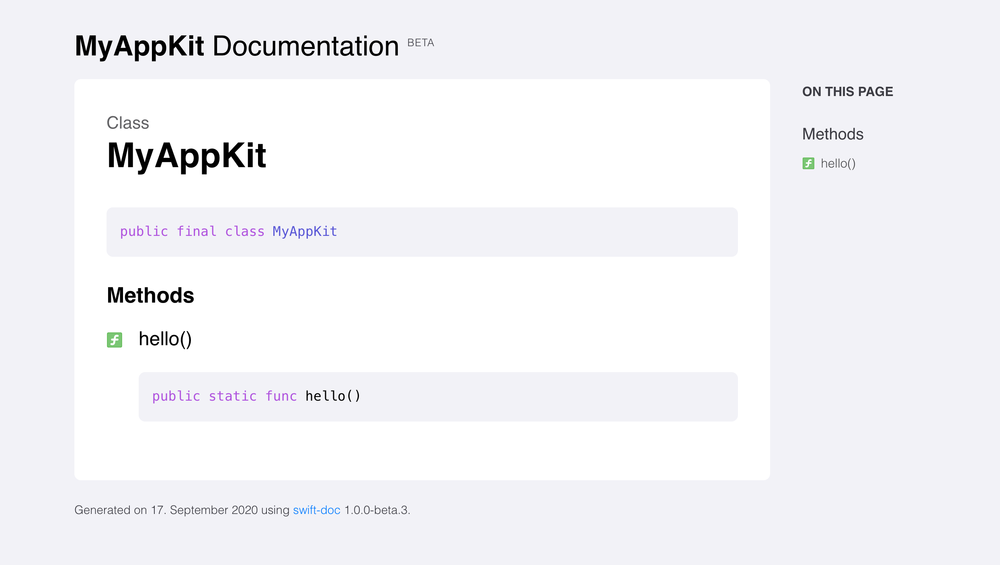

One of the areas that Tuist started exploring further since we hit version 1.0 is automation. The primary motivation was providing a more standard and better-integrated experience to users by leveraging the knowledge Tuist has on users’ projects. Since then, we have seen great features like `tuist build` landing in the project.

Unlike other automation tools like [Fastlane](https://fastlane.tools), Tuist doesn’t installing of third-party packages through tools like [Homebrew](https://brew.sh), or having a Ruby environment configured, leading to well-known reproducibility issues. Tuist’s automation puts **developer’s experience over flexibility**, even if that means going a bit off the industry standards.

There’s a huge opportunity to build standard automation that is **easy, deterministic, and works reliably**. Today we are taking a step further and bringing **three major features** in our latest release 1.18.0. Let’s dive right into them.

## Generate documentation for your targets

When working in a modular code base, users might need to consume the public API implemented by another target (e.g., target). nless the user is already familiar with the API, it’s useful to have documentation that users can read through to understand better what’s available and how they can use it.
Other programming environments like Rust, provide a `doc` command through their package manager, [Cargo](https://doc.rust-lang.org/cargo/). However, that’s not a thing in Xcode nor the Swift Package Manager, and for that reason, we are taking inspiration from Cargo and bringing the functionality to Xcode’s land. Since Tuist 1.18.0, users can run the following command:

```bash
tuist doc MyFramework
```

The command generates documentation for the given target using [swift-doc](https://github.com/SwiftDocOrg/swift-doc) by [Mattt](https://twitter.com/mattt) and opens it on the browser for users to check it out. Once they are done checking out the documentation, Tuist deletes it automatically.

The image below shows an example of auto-generated documentation:



You can read more about the feature [here](https://docs.tuist.io/commands/documentation/).

## Auto-generate Swift interfaces for type-safe access to resources

One of the downsides of accessing resources using strings is that nothing prevents developers from using an invalid string and releasing an app where some resources are missing in the UI. What's worse, the app crashes because the implementation expects a resource to be available. [SwiftGen](https://github.com/SwiftGen/SwiftGen) solved that problem by generating Swift interfaces to access the resources that belong to a target.

We think it's a brilliant idea worth incorporating into Tuist, and that's what we did in this release. Tuist automatically generates a Swift interface for accessing the resources and adds it to the target automatically. Users don't have to install SwiftGen, ensure that their targets are well-configured, or add extra lanes into their `Fastfiles`. The generation of those interfaces happens seamlessly at project generation time.

You can check out [this documentation page](https://docs.tuist.io/guides/resources/) to learn more about the feature.

## Lint your Swift code

In large teams, it becomes essential to have a set of code style guidelines that ensures everyone uses the same style when writing Swift. Teams usually achieve that with widely-used tools like [SwiftLint](https://github.com/realm/SwiftLint).

Tuist 1.18.0 integrates that functionality into a new command that takes care of calling SwiftLint with the right arguments depending on users' intents:

```
tuist lint code
tuist lint code MyTarget
```

You can read more about the functionality and how to provide your SwiftLint configuration on [this page](https://docs.tuist.io/commands/linting/).

## What's next

We are continuing to invest in automation. We'll soon start working on `tuist test` to be able to run tests directly from the terminal. Moreover, we are planning the work on a standard interface for defining third-party dependencies. It has been in our backlog for a long time and that we finally set out to tackle.

Besides that, we are also investing in caching and insights to help boost developers' productivity and provide teams with insights about their projects that allow them to make informed decisions.
