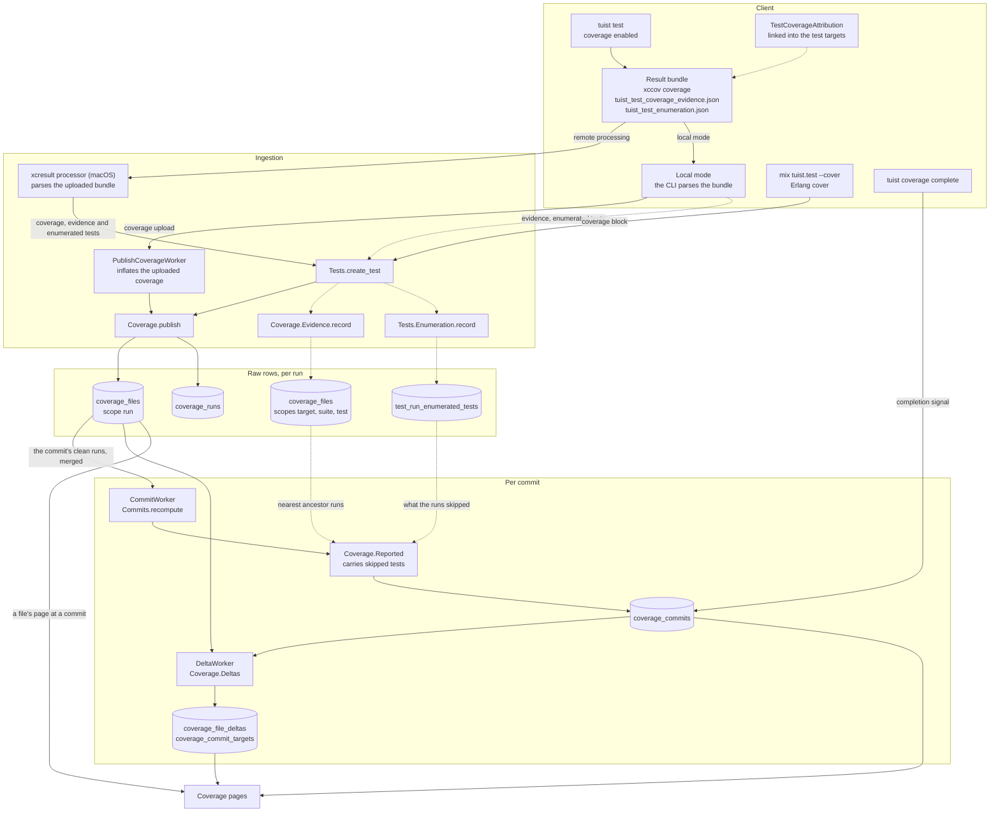

# Code coverage

How Tuist collects, stores and shows code coverage. Coverage is in early access behind `Tuist.FeatureFlags.xcode_coverage_enabled?/1`.

## Scopes

Every coverage row in `coverage_files` belongs to a scope: `scope_kind` says what the row describes, and `scope_id` says which one. All build systems share the same scopes. Each build system fills in the ones it can measure.

| Scope | `scope_id` | What it holds |
| --- | --- | --- |
| `run` | empty | Everything one test run measured. Per file: the executable lines and how many times each ran, the functions, branch counters when the tool reports them, the code targets that compiled the file, and whether the file is test code. |
| `target` | the test module | Everything a test target's processes executed, from start to finish. |
| `suite` | module and suite | What ran around a suite's tests without belonging to any one of them, such as a class `setUp` or a suite's one-time setup. |
| `test` | module, suite and name | What a single test executed. |

The `run` scope is **measured coverage**. Every figure Tuist shows is computed from it, merged across a run's shards and across all the runs of a commit.

The `target`, `suite` and `test` scopes are **evidence**. They record which files, and where possible which lines, each scope executed. Unlike `run` rows, they hold no execution counts and no Git blob: the blob is read from the run's own row for the path, or from the commit's file listing. A file whose lines would exceed the report's line budget keeps only its path. No coverage total ever reads evidence rows directly. They feed two things:

- **Carried coverage.** A run that skipped tests (selective testing) measures only part of the code. The tests it skipped are carried forward from the nearest earlier run whose evidence still applies, and their lines count as covered at the commit (`Tuist.Tests.Coverage.Reported`).
- **Test selection.** Picking which tests to run from the files they executed (planned).

### What the UI shows for each scope

| Scope | Shown in the UI |
| --- | --- |
| `run` | A commit's and a branch's totals and trend, the targets and files tables, and each file's page: its figures, its functions (line, covered lines, executions) and its trend. Per-line execution counts are stored, but no page shows the source line by line yet. |
| `target`, `suite`, `test` | Never shown on their own. They show up only through carried coverage: the commit's figure includes the lines carried from skipped tests, and a file's page lists them as "Covered by skipped tests, carried forward". Why a figure is `observed` (`coverage_commits.gap_reasons`) is stored but not displayed yet. |

Without evidence, a run that skipped tests can only report what it ran: its commit's figure is `observed`, and it stays out of the coverage trend.

## How the data flows

Solid arrows carry the `run` scope (measured coverage). Dashed arrows carry the `target`, `suite` and `test` scopes (evidence) and the enumerated tests that carrying needs.

1. **Measure.** `tuist test` runs the tests with coverage on. When the test targets link TestCoverageAttribution and evidence collection is on, the package records per test process what each test executed. Tuist also enumerates every test the run could have executed. All of it lands in the result bundle. Mix measures only the `run` scope.
2. **Ingest.** The bundle is parsed either by the macOS xcresult processor (remote processing) or by the CLI itself (local mode, which uploads the coverage and sends the evidence and enumeration with the run). `Coverage.publish` stores the `run` rows and the run's totals. `Coverage.Evidence.record` stores the `target`, `suite` and `test` rows. `Tests.Enumeration.record` stores the enumerated tests.
3. **Fold.** A few seconds after each report, `CommitWorker` recomputes the commit from the `run` rows of its clean runs. When those runs skipped tests, `Coverage.Reported` carries the skipped tests' coverage from the evidence of the nearest ancestor runs. The result is written to `coverage_commits`.
4. **Complete.** `tuist coverage complete` marks the commit's coverage complete. A complete commit's per-file figures are then stored as deltas.
5. **Read.** The pages read totals and trends from `coverage_commits`, files and targets from the deltas, and a file's details from the raw `run` rows.

## Carried coverage

A run that skips tests measures less than the commit is covered by. `Tuist.Tests.Coverage.Reported` fills in the tests it skipped with the coverage they had in an earlier run, wherever that coverage provably still applies. Carrying is **all or nothing**: when one skipped test or one file can't be accounted for exactly, nothing is carried, and the commit's figure is what its runs measured, marked `observed`, with `gap_reasons` saying why.

### When it applies

The skipped tests are the commit's **candidates** minus the tests its runs executed. The candidates are the tests the runs enumerated (`xcodebuild -enumerate-tests`, with the run's filters removed). For a scheme that selective testing skipped as a whole, or a test target a generated project left out of the workspace, they come from the nearest ancestor run that listed them.

| Situation | Figure (`reported_kind`) | In trends and baselines |
| --- | --- | --- |
| The runs skipped nothing, and compiled every file the nearest ancestor that measured the same schemes covered. | `measured`: what the runs measured. | Yes |
| Every skipped test was carried exactly and no file was left out. | `reported`: measured plus carried. | Yes |
| Anything else: a skipped test or a file that couldn't be accounted for, or runs that listed no candidates, so what they skipped can't be told. | `observed`: what the runs measured. | No |

Commits folded before this rule may still be `partial`. They're read like `observed` (`Tuist.Tests.Coverage.Commits.incomplete?/1`) until they're folded again.

**The file check on measured commits.** A run that executed the whole suite can still have measured less: a module the build took from a binary cache runs without coverage instrumentation, so what the tests executed in it is unknown. When a file the nearest ancestor that measured the same schemes covered wasn't compiled by any run at the commit, and the commit's listing still has it, the figure is `observed` (`unbuilt_file_uncarried`, or `unbuilt_file_changed` when its blob changed).

### How it is decided

1. **The commit changes a tracked file.** If the commit's tracked files (`Package.resolved`, `Project.swift`, `*.xcconfig`, … see `Tuist.GitHistory` `tracked_file_globs`) differ from its first parent's, nothing is carried, and no evidence is read: every ancestor's evidence predates the change. When either listing is missing, this step is skipped and step 3 checks each source instead.
2. **Group the skipped tests into units, each with one source run.**
   - A test target selective testing skipped is one unit, carried from its `target` evidence. Only ancestor runs that hashed the target the same way as the commit's run qualify: the same hash means the same inputs, so the same tests over the same code. Among those, the nearest wins.
   - Every other skipped test is a unit of its own, carried from its `test` evidence plus its suite's `suite` evidence, from the nearest ancestor run that holds it. That includes the tests of a skipped target that couldn't be carried whole.
   - The nearest run is fewest commits back, then newest, among the clean-checkout runs on the commit's ancestors within the history window. It's picked in ClickHouse a chunk of runs at a time, nearest first.
   - A test with no source is a gap, and the reason says why from what the ancestor runs collected: `no_ancestor`, `collection_off`, `evidence_expired`, `not_linked`, `overlapped` or `no_evidence`.
3. **Check that each unit's source still applies.** All of these must hold:
   1. The test passed in the source run, or the target had no failing test there (`test_failed`).
   2. The tracked files are identical at the source commit and at the commit (`tracked_file_changed`, or `listing_missing` when a listing isn't stored).
   3. The evidence holds lines, not only paths, for every file that counts (`evidence_without_lines`).
   4. Every file the unit executed has the same Git blob at the commit as at the source commit (`executed_file_changed`). This applies to whole targets too, which catches an input outside the declared dependency graph. Only files Git tracks count: a submodule's file has no blob to compare.

   These checks read which files each unit's evidence touches and whether it recorded lines, never the lines themselves.
4. **Carry.** Only when every unit passes are the lines read: the units' lines on the files that count are merged per file in ClickHouse, which returns one set of lines per file. A file counts when it's product code, not test code, isn't an excluded path, and the source run reported it.

### What it does to each file

- **A file a run at the commit measured:** a line is covered when the commit's runs covered it or it was carried. Only the file's executable lines at the commit count.
- **A file only the source compiled:** its executable lines come from the source run, and its covered lines are the carried ones.
- **A file no run at the commit compiled** (a selective run builds part of the project): the nearest ancestor that measured the commit's schemes says which files exist. With the same blob, the file keeps that ancestor's executable lines, and its covered lines are the carried ones. If the ancestor covered more than was carried (`unbuilt_file_uncarried`), its blob changed (`unbuilt_file_changed`), or there's no such ancestor or listing (`unbuilt_file_unknown`), the figure is `observed`. A file that's gone from the listing is dropped.

The reasons are stored as a bitmask in `coverage_commits.gap_reasons` (`Tuist.Tests.Coverage.GapReasons`). A carried line has no execution count, because no run at the commit executed it. A file's page lists those lines as "Covered by skipped tests, carried forward".

### Planned: deciding the carry with the selection algorithm

The checks above work from each skipped unit's evidence and its own source. The plan is to decide the carry with the same classification test selection uses (see [The algorithm](#the-algorithm)), computed for the commit after its runs reported:

| | Ran at the commit | Not run at the commit |
| --- | --- | --- |
| **Must run** | Measured. | **Gap**, with the reason the classification gave. |
| **Can skip** | Measured. Nothing to carry. | **Carried** from its baseline. |

The commit is `observed` exactly when some test that had to run didn't. What changes compared with the per-test checks:

- **One classification, two uses.** Selection and the carry can't disagree, as long as the fold uses the baseline the selection used. The selection plan records it per run, and the fold reads it from there. Without a plan, the fold picks the baselines the same way.
- **The target hash isn't needed for the carry.** A target that hash-based selective testing skipped is carried when none of its tests must run. If its evidence touches a changed file, it's a gap. That gap marks an input the hash missed, such as a file outside the target's dependency graph. Today that only shows up as a per-test gap.
- **The policy rules don't apply.** New, flaky, recently failed and unskippable tests are about the risk of missing a failure, not about whether coverage is valid. A skipped flaky test whose evidence applies is carried.
- **Files no run compiled** are decided as they are today ([What it does to each file](#what-it-does-to-each-file)).

## Test selection based on coverage (planned)

> [!NOTE]
> Not implemented yet. The data it needs is collected today: the `target`, `suite` and `test` evidence, the enumerated tests, the commit graph with file listings, and the tracked files. Nothing reads it for selection yet.

Selection skips the tests whose executed code didn't change. It evaluates the same condition as carried coverage, whether a test's evidence still applies at the commit, but uses it for something else. Selection uses it before the run, to skip a test. Carried coverage uses it after the run, to reuse the coverage of a test that was skipped. They are not each other's inverse. Selection also runs some tests whose evidence applies (new, flaky, recently failed, unskippable), and carried coverage also handles tests that other mechanisms skipped and files no run compiled. The classification below is meant to serve both ([Planned: deciding the carry with the selection algorithm](#planned-deciding-the-carry-with-the-selection-algorithm)).

### The algorithm

For a commit C, the candidates are the tests its runs can execute (the enumerated tests).

1. **Tracked files.** If a tracked file differs between C and its first parent, or between C and the baseline below, every candidate must run.
2. **Baselines.** Per scheme, the baseline is the nearest ancestor run with evidence, typically the full run on the default branch that collects it. Each candidate takes its evidence from the nearest baseline that holds evidence for it. A few baselines, nearest first, keep the comparisons below to one per baseline while still finding the evidence of a test the nearest one didn't run.
3. **Changed files.** Compare the file listings of the baseline's commit and C. Δ is every path whose blob differs, was added or was removed: source files, resources, fixtures and configuration alike.
4. **Impacted tests.** The tests whose `test` or `suite` evidence in the baseline touches a path in Δ, read in one ClickHouse query that returns only test ids. A target with only `target` evidence is impacted as a whole.
5. **Unreferenced changes.** A changed path that no evidence of the baseline references falls back conservatively. With a known owner (the targets that compiled a code file, from the `run` rows), it selects that target's tests. Without one, as for a resource, it selects every candidate.
6. **Classify.** A candidate **must run** when any of these holds:
   - it is impacted or caught by the fallback;
   - it has no evidence that applies: none, overlapped, expired, failed in the baseline, or holding paths without lines (carrying needs the lines);
   - selection only: it is new, failed recently, is flaky, or is marked unskippable.

   Otherwise it **can skip**. Anything missing or ambiguous means the test runs.

### What the changed files can't see

Comparing blobs detects every change. Linking a change to the tests it affects is the hard part, because evidence only links a test to the code it executed.

| What changed | Covered by |
| --- | --- |
| Code a test executed | Step 4. |
| Resources, fixtures, assets | Step 5. It's safe, but it runs every candidate until non-code files can be mapped to the target that ships them. Coverage data doesn't hold that; the project graph does. |
| Build settings | Tracked files, so everything runs (step 1). |
| Files with only declarations | Step 5, when no test executed anything in the file. Not covered: a file test A executed and test B depends on only at compile time (a folded constant, a type). A runs, B can skip. |
| Compile-time code (Swift macros, Elixir macros) | Not covered: the code a macro generates isn't linked to the macro's file. Mix can close it with the compiler's xref graph. Swift has no equivalent yet. |
| UI tests, tests without evidence | No evidence to decide with, so they always run. That costs runtime, not correctness. |

### The floor

Every project has a **floor**, the tests that would run without evidence:

| Project | Floor |
| --- | --- |
| Generated Xcode project | Hash-based selective testing: whole test targets skipped when their hash is unchanged. |
| Bazel | The `rdeps` of the changed files. |
| Non-generated Xcode project, Gradle, Mix | Every test: they have no other selection, so evidence adds one. |

Evidence only narrows below the floor; it never brings back a test the floor skipped. The hash covers what the changed files can't see: compile-time dependencies, and which target a non-code file belongs to. So it stays the floor until coverage-only selection passes the dry run with no missed failures on real projects. For the carry, the hash isn't needed at all ([Planned: deciding the carry with the selection algorithm](#planned-deciding-the-carry-with-the-selection-algorithm)).

### Per build system

- **Xcode:** generated projects keep hash-based selective testing as the floor, and evidence narrows inside the targets it selects (`-only-testing`). Non-generated projects (`tuist xcodebuild test`) get selection from evidence alone. Narrowing below a target needs `test` evidence, so serial runs, plus the trait for Swift Testing. Without it, the target is selected or skipped whole.
- **Mix:** selection will be based on coverage alone, so it has to close the gaps itself:
  - **Compile-time dependencies.** A test that exercises a module built with a macro (`use`, Ecto schemas, Phoenix routers) never executes the macro's code at runtime. Selection must also select the tests whose files compile-time depend on a changed file (`mix xref graph --label compile`).
  - **Async tests.** `cover` counts are VM-wide, and `async: true` modules run concurrently, so their evidence can't be attributed per test or per module. Either collect evidence in a serial run (`--max-cases 1`) and select from it, or always run async modules.
  - **Non-code inputs.** The tracked files for a Mix project must include at least `mix.exs`, `mix.lock`, `config/**`, `priv/**` and the toolchain pin (`mise.toml`, `.tool-versions`). Today's defaults are Xcode-only.
- **Bazel:** the `rdeps` floor, narrowed by evidence. A target in the `rdeps` set with no evidence is selected.

### The plan

Each selection produces a plan, kept as an artifact of the run: the selected and skipped tests with a reason for each, the baseline each decision used, the changed files that forced tests in, the fallback reason if everything ran, and the estimated time saved. The fold reads the baselines from it, so the carry matches the selection. Before it is enforced, selection runs in **dry-run** mode: everything runs, and the plan is compared with the actual results. A test the plan would have skipped that failed is a missed failure, and there must be none.

## Storage

Scopes exist only in the raw per-run rows. Everything kept for longer is derived from them per commit.

| Table | Database | What it holds | Retention |
| --- | --- | --- | --- |
| `coverage_files` | ClickHouse | The raw rows of every scope, one set per run and shard report. | `TUIST_COVERAGE_FILE_RETENTION_DAYS` (90) |
| `coverage_runs` | ClickHouse | Each run's totals. | `TUIST_COVERAGE_RUN_RETENTION_DAYS` (365) |
| `coverage_commits` | PostgreSQL | Each commit's totals: the union of its runs' `run` rows, with carried coverage applied. | `TUIST_COVERAGE_COMMIT_RETENTION_DAYS` (1095), or `TUIST_COVERAGE_PULL_REQUEST_COMMIT_RETENTION_DAYS` (90) for a pull request's own commits |
| `coverage_file_deltas` | ClickHouse | A complete commit's per-file `covered_lines` and `executable_lines`, carried coverage applied, stored only where they differ from the previous complete commit on its ref. No lines and no scopes. | `TUIST_COVERAGE_COMMIT_RETENTION_DAYS`, by commit date |
| `coverage_commit_targets` | ClickHouse | A complete commit's targets. | `TUIST_COVERAGE_COMMIT_RETENTION_DAYS`, by commit date |

Which of them the pages read:

- A commit's and a branch's totals and trend come from `coverage_commits`.
- The files table, the targets, the changed files and a file's trend come from the deltas when they are current, and otherwise from the raw rows (`Tuist.Tests.Coverage.Deltas`).
- A file's page at a commit (its figures, functions, per-line counts and carried lines) reads the raw `coverage_files` rows. Once those expire, a file's trend is still there, but its details at older commits are not.

## Xcode

Xcode measures only the `run` scope itself. The other three come from [TestCoverageAttribution](https://github.com/tuist/TestCoverageAttribution), a package linked into the test targets that attributes Xcode's coverage counters to the code each test process and each test executed.

| Scope | Source | Requirements |
| --- | --- | --- |
| `run` | Xcode's coverage, read with `xccov` (`view --report` for targets and functions, `view --archive` for per-line execution counts), on the macOS xcresult processor for uploaded result bundles or on the client in local mode. | `-enableCodeCoverage YES`. Files compiled only into `.xctest` bundles are flagged as test code and left out of every figure. |
| `target` | TestCoverageAttribution: everything the target's test process executed. | The package linked into the test target and evidence collection on (`TUIST_COVERAGE_EVIDENCE=1`, which makes Tuist set `TEST_COVERAGE_ATTRIBUTION_DIR` for the test process). Works with parallel testing and with Swift Testing suites that lack the trait. |
| `test` | TestCoverageAttribution: one record per test. | Same as `target`. XCTest needs nothing more. Swift Testing needs the `.coverageAttribution` trait on its suites. Tests must run one at a time (`-parallel-testing-enabled NO`): a test that overlaps another is flagged as overlapped and gets no evidence of its own (`test_case_runs.coverage_evidence` = `overlapped`). |
| `suite` | TestCoverageAttribution: the records of what ran between tests. | Same as `test`. |

Limitations that apply to all the attributed scopes:

- UI tests record nothing about the app, because the app's code runs in a process that doesn't link the package.
- Images loaded after the first test starts, such as a framework the tests `dlopen`, are missing from the records.
- Recording works on macOS and the iOS simulator only, not on devices.
- When tests run in parallel inside one process, coverage counters must be bumped atomically (`OTHER_SWIFT_FLAGS=$(inherited) -Xllvm -instrprof-atomic-counter-update-all`). Plain increments lose counts, which `xccov` reports as negative counts and as lines covered that never ran.

Enumerated tests: Tuist lists every test the run could execute with `xcodebuild -enumerate-tests`, over the built products and with the run's filters removed, so `-only-testing` doesn't narrow it. The list is written into the result bundle as `tuist_test_enumeration.json`. It is what tells carried coverage which tests a run skipped.

## Mix

`mix tuist.test --cover` (the `tuist_ex` package) measures only the `run` scope, read from Erlang's `cover` once the suite finishes. An OTP application is a target, and the files under the project's test paths are test code. Mix has no `target`, `suite` or `test` evidence yet.

| Scope | Source | Requirements |
| --- | --- | --- |
| `run` | Erlang's `cover`, sent as the `coverage` block (`tool` `cover`). | `--cover`. |
| `target`, `suite`, `test` | Not collected. | |

A run is marked partial when its arguments leave tests out: `--only`, `--exclude`, `--failed`, `--stale`, `--name-pattern`, `--max-failures`, or explicit test files or lines (`TuistEx.Analytics.Coverage.partial?/1`). A commit is `measured` only when its runs list their candidates (the enumerated tests below) and skipped none of them. A partial run has no evidence to carry from, so its commit is `observed`.

### Enumerated tests

With `--cover`, `mix tuist.test` sends the tests the run could have executed as `enumerated_tests`, the counterpart of `xcodebuild -enumerate-tests`, which carried coverage and coverage-based selection both need: without it, a partial run can't say which tests it skipped. Each test carries the identity its test case runs have (the module, the `describe` block as the suite, and the test's own name), so `Tests.Enumeration.record` stores it under the same test case id. The list is built without running any test (`TuistEx.Analytics.Enumeration`):

- **A full run, `--only`, `--exclude`, `--name-pattern`:** ExUnit loads every test file and reports each test it filtered out to the formatters with state `{:excluded, _}`. `TuistEx.Analytics.ExUnitFormatter` records those, with the tests that ran, at no extra cost.
- **`--stale`, `--failed`, explicit files or lines, `--max-failures`, or a suite that stopped early:** ExUnit never reports some tests: unloaded files, the tests `--failed` drops before filtering, the ones `--max-failures` never reached. After the run, in the same VM, `mix tuist.test` reads every test module's `__ex_unit__/0` and requires only the test files that weren't loaded. A second `mix test --only <a tag no test has>` would have reported every test as excluded through the same formatter, but it boots another VM, compiles every test file, runs `test_helper.exs` again (usually starting the application and its database), and still can't see what `--failed` drops. `__ex_unit__/0` is what `ExUnit.Runner` itself reads.

A list that can't be completed is not sent, since missing tests would read as tests the run was never meant to have. A shard lists only its share; the server unions the shards of a run. Runs without `--cover` send no list.

Enumeration on its own doesn't make a partial Mix commit `reported`: with only the `run` scope, a skipped test has no evidence to carry. It becomes useful once Mix collects evidence and selection starts choosing the tests to run.
