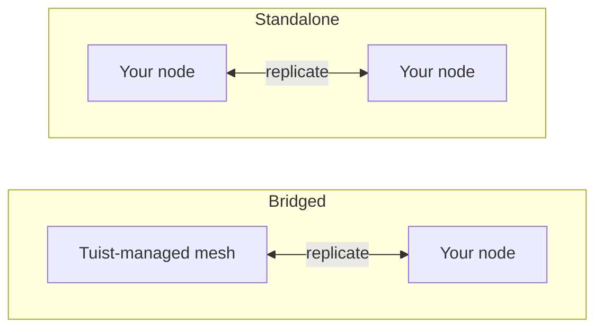

---
{
  "title": "Self-hosting",
  "titleTemplate": ":title | Cache | Guides | Tuist",
  "description": "Learn how to self-host Tuist cache nodes and replicate with the Tuist-hosted mesh."
}
---

# Self-host Cache {#self-host-cache}

Tuist's cache runs as a **mesh of nodes** that replicate artifacts to each other. You can run your own cache nodes on your infrastructure so the cache sits next to your developers and CI, cutting the network distance that would otherwise eat into the speed caching is meant to provide.

A self-hosted node is a single container (`ghcr.io/tuist/kura`) that stores artifacts on local disk and talks to the rest of the mesh over a mutually-authenticated peer connection. Tuist acts as the **control plane**: it authenticates traffic, tells the Tuist CLI which cache endpoint to use, and meters usage. It never reaches into your nodes.

> [!NOTE]
> Self-hosting cache nodes requires an **Enterprise plan**.
>
> Nodes connect to either the hosted Tuist server (`https://tuist.dev`) or a self-hosted Tuist server. Self-hosting the Tuist server itself requires a separate server license. See the <.localized_link href="/guides/server/self-host/server">server self-hosting guide</.localized_link>.

## Two topologies {#topologies}

There are two ways to run self-hosted nodes, and which one you get depends entirely on whether your account also runs a **Tuist-managed** cache region.

### Bridged: Tuist-hosted mesh + your nodes {#topology-bridged}

Your account runs at least one Tuist-managed cache region, and your self-hosted nodes **join that mesh**. Writes against your nodes propagate continuously into the managed mesh, and a node warms from the managed mesh's existing cache when it joins. This puts a low-latency cache next to your runners (which do most of the writing) while their writes feed the shared cache. Note that new artifacts written elsewhere in the managed mesh **after** a node has joined are not yet continuously propagated back to it; that is a planned enhancement.

This is the right choice when you want the speed of an on-prem cache without giving up the shared, always-on managed cache.

### Standalone: your nodes only {#topology-standalone}

Your account runs **no** managed cache region. Your nodes form their own isolated mesh on your infrastructure. Tuist still knows your nodes exist (so the CLI routes cache traffic to them and usage is metered), but **no data is exchanged with any Tuist-managed mesh**, because there isn't one. Peer membership and replication happen entirely within your own nodes.



The key difference in configuration is that the **bridged** topology uses **enrollment**, where the node generates its keypair on boot and Tuist issues its mesh certificate, while the **standalone** topology has no Tuist-issued mesh certificate, so you provide your own peer TLS.

## Prerequisites {#prerequisites}

- Docker and Docker Compose (or any container runtime)
- A running Tuist server (hosted or self-hosted)
- Disk for the cache. A bridged node pulls the account's **entire** mesh on first join, so size the data volume accordingly.

## Create a control-plane client {#control-plane-client}

A node uses an account-scoped control-plane client to authenticate cache requests (token introspection), report to the dashboard, and deliver usage. It is **not** how clients are routed to your nodes (see [How clients reach your nodes](#routing)), so a single node on a trusted network can run without one.

1. Open your account's **Cache** page. On a self-hosted Tuist server it is available by default (the deployment's license is the entitlement). On the hosted `tuist.dev` server it requires an Enterprise plan and the `kura` feature flag.
2. Choose **Generate credential**.
3. Copy the `client_id` and the one-time `secret`.

The server derives the account from this credential, so the node never asserts its own tenant. Rotate or revoke it from the same page.

## How clients reach your nodes {#routing}

How the Tuist CLI is pointed at your nodes depends on which server your nodes report to:

- **Hosted Tuist server (`tuist.dev`).** The server routes clients to your nodes automatically from their registration heartbeats. Set `KURA_REGISTRATION_URL` and `KURA_ADVERTISED_HTTP_URL` on each node (below), and the advertised URL is handed to the CLI once the node is ready.
- **Self-hosted Tuist server.** You tell the server which cache endpoints to advertise by setting `TUIST_CACHE_ENDPOINTS` (Helm `server.cacheEndpointUrl`) to your node's client-facing URL, comma-separated for multiple nodes. Registration heartbeats still populate the **Cache** page, but they do not drive routing on a self-hosted server.

## Bridged setup {#bridged-setup}

The node enrolls on boot: it generates a keypair locally (the private key never leaves your infrastructure), sends a certificate signing request, and receives its signed certificate, the account CA, and the managed mesh's gateway address. **You do not provide any TLS material**. Enrollment writes it into the mounted volume.

```yaml
# docker-compose.yml
services:
  kura:
    image: ghcr.io/tuist/kura:<version>
    restart: unless-stopped
    ports:
      - "4000:4000"   # HTTP cache: your developers and CI point here
      - "7443:7443"   # mesh peer port
    environment:
      # Enroll and join the managed mesh
      KURA_ENROLL_ON_BOOT: "1"
      KURA_CONTROL_PLANE_URL: "https://tuist.dev"
      KURA_CONTROL_PLANE_CLIENT_ID: "<client_id>"
      KURA_CONTROL_PLANE_CLIENT_SECRET: "<secret>"
      KURA_TENANT_ID: "<account-handle>"

      # Register so the node shows in the dashboard and the CLI routes to it
      KURA_REGISTRATION_URL: "https://tuist.dev/_internal/kura/mesh/registrations"
      KURA_ADVERTISED_HTTP_URL: "https://kura.acme.internal"   # where your CLI/CI reach the cache
      KURA_NODE_URL: "https://kura.acme.internal:7443"         # this node's peer identity on your network
      KURA_REGION: "office"

      # Ports and storage. Enrollment writes the TLS files into KURA_INTERNAL_TLS_* on first boot.
      KURA_PORT: "4000"
      KURA_GRPC_PORT: "50051"
      KURA_INTERNAL_PORT: "7443"
      KURA_INTERNAL_TLS_CA_CERT_PATH: "/tls/ca.pem"
      KURA_INTERNAL_TLS_CERT_PATH: "/tls/tls.crt"
      KURA_INTERNAL_TLS_KEY_PATH: "/tls/tls.key"
      KURA_DATA_DIR: "/var/cache/kura"
      KURA_TMP_DIR: "/var/cache/kura/tmp"
      KURA_OTEL_SERVICE_NAME: "kura-acme"
      KURA_OTEL_DEPLOYMENT_ENVIRONMENT: "onprem"

      # Authenticate the HTTP cache API. The Tuist hook ships in the image at
      # this path; it introspects each token against the control plane using the
      # control-plane client above, so only valid Tuist tokens for this account
      # can read or write. No JWT verifier secret is involved.
      KURA_EXTENSION_ENABLED: "1"
      KURA_EXTENSION_SCRIPT_PATH: "/etc/kura/extensions/tuist.lua"
      KURA_EXTENSION_HTTP_CLIENT_TUIST_BASE_URL: "https://tuist.dev"
    volumes:
      - kura-tls:/tls            # empty; enrollment populates it
      - kura-data:/var/cache/kura
volumes:
  kura-tls: {}
  kura-data: {}
```

What you provide: the control-plane client, the two addresses (`KURA_NODE_URL`, `KURA_ADVERTISED_HTTP_URL`) on your network, and two empty writable volumes. Everything else (the keypair, the certificate, the account CA, and the managed mesh's address) is provisioned automatically on boot.

## Standalone setup {#standalone-setup}

With no managed region there is no Tuist-issued mesh CA, so enrollment does not apply (the enroll endpoint returns `503 ca_unavailable`). You bring your own peer TLS and your own peer list.

```yaml
# docker-compose.yml
services:
  kura:
    image: ghcr.io/tuist/kura:<version>
    restart: unless-stopped
    ports:
      - "4000:4000"
      - "7443:7443"
    environment:
      # Report to Tuist: dashboard visibility, usage, and token introspection (cache auth).
      # On a self-hosted server these do not drive routing (see the Routing section), so the
      # control-plane client and KURA_REGISTRATION_URL/KURA_ADVERTISED_HTTP_URL are optional
      # there. KURA_TENANT_ID is always required.
      KURA_TENANT_ID: "<account-handle>"
      KURA_CONTROL_PLANE_URL: "https://tuist.dev"
      KURA_REGISTRATION_URL: "https://tuist.dev/_internal/kura/mesh/registrations"
      KURA_CONTROL_PLANE_CLIENT_ID: "<client_id>"
      KURA_CONTROL_PLANE_CLIENT_SECRET: "<secret>"
      KURA_ADVERTISED_HTTP_URL: "https://kura.acme.internal"

      # Your own mesh (only needed if you run more than one node)
      KURA_NODE_URL: "https://kura-1.acme.internal:7443"
      KURA_PEERS: "https://kura-2.acme.internal:7443,https://kura-3.acme.internal:7443"

      # Peer mTLS secures node-to-node traffic, so it only applies with more than one node.
      # A single node has no peers: omit these three and switch KURA_NODE_URL to
      # http:// (keep the same host and port; the peer URL must use http, not
      # https, when peer TLS is off).
      KURA_INTERNAL_TLS_CA_CERT_PATH: "/tls/ca.pem"
      KURA_INTERNAL_TLS_CERT_PATH: "/tls/tls.crt"
      KURA_INTERNAL_TLS_KEY_PATH: "/tls/tls.key"

      KURA_REGION: "office"
      KURA_PORT: "4000"
      KURA_GRPC_PORT: "50051"
      KURA_INTERNAL_PORT: "7443"
      KURA_DATA_DIR: "/var/cache/kura"
      KURA_TMP_DIR: "/var/cache/kura/tmp"
      KURA_OTEL_SERVICE_NAME: "kura-acme"
      KURA_OTEL_DEPLOYMENT_ENVIRONMENT: "onprem"

      # Authenticate the HTTP cache API with the bundled Tuist hook (introspects
      # tokens against the control plane using the control-plane client above).
      KURA_EXTENSION_ENABLED: "1"
      KURA_EXTENSION_SCRIPT_PATH: "/etc/kura/extensions/tuist.lua"
      KURA_EXTENSION_HTTP_CLIENT_TUIST_BASE_URL: "https://tuist.dev"
    volumes:
      - ./tls:/tls:ro           # YOU populate this with your CA + leaf
      - kura-data:/var/cache/kura
volumes:
  kura-data: {}
```

What you provide that the bridged path does not: for a multi-node mesh, your **own peer TLS** mounted at `/tls` (a CA plus a leaf certificate and key per node, sharing a CA so the nodes trust each other) and `KURA_PEERS` describing your topology. A single standalone node needs neither: with no peers, nothing travels over the peer plane, so omit `KURA_INTERNAL_TLS_*` and `KURA_PEERS`, and use the `http://` scheme for `KURA_NODE_URL` (peer TLS off requires `http` rather than `https`; the host and `KURA_INTERNAL_PORT` stay the same).

## What each topology requires {#requirements-summary}

| You provide | Bridged | Standalone |
|---|---|---|
| Control-plane client (`client_id` / `secret`) | Yes | For cache auth, dashboard, and usage; optional for a trusted single node |
| `KURA_NODE_URL` | Yes | Yes |
| `KURA_ADVERTISED_HTTP_URL` | Yes | For dashboard registration; routing is separate (see below) |
| Routing to the CLI | Automatic (registration) | Automatic against the hosted server; on a self-hosted server, `TUIST_CACHE_ENDPOINTS` |
| Data + temp volume | Yes | Yes |
| `KURA_ENROLL_ON_BOOT` | Yes | No (would return `ca_unavailable`) |
| Peer TLS (`/tls` CA + leaf) | No, enrollment writes it | Only for a multi-node mesh |
| `KURA_PEERS` (peer list) | No, enrollment seeds the gateway | Yes, if more than one node |

## Required configuration {#required-config}

These variables configure every node, regardless of topology (peer TLS is the exception noted below):

| Variable | Description |
|---|---|
| `KURA_TENANT_ID` | Your account handle. |
| `KURA_NODE_URL` | This node's peer URL on your network. |
| `KURA_REGION` | A free-form region label (e.g. `office`, `ci`). |
| `KURA_PORT` / `KURA_GRPC_PORT` / `KURA_INTERNAL_PORT` | HTTP cache, gRPC, and mesh peer ports (`4000` / `50051` / `7443`). |
| `KURA_DATA_DIR` / `KURA_TMP_DIR` | On-disk artifact storage and scratch directory. |
| `KURA_INTERNAL_TLS_CA_CERT_PATH` / `KURA_INTERNAL_TLS_CERT_PATH` / `KURA_INTERNAL_TLS_KEY_PATH` | Peer TLS files. Written by enrollment (bridged) or provided by you (multi-node standalone). Not needed for a single node; omit them and use an `http://` `KURA_NODE_URL`. |
| `KURA_OTEL_SERVICE_NAME` / `KURA_OTEL_DEPLOYMENT_ENVIRONMENT` | Service name and environment label for telemetry. |

Bridged nodes additionally set `KURA_ENROLL_ON_BOOT`, `KURA_CONTROL_PLANE_URL`, and the control-plane client credentials. `KURA_REGISTRATION_URL` and `KURA_ADVERTISED_HTTP_URL` register a node so it appears on the **Cache** page; against the hosted server they also route the CLI to it, while a self-hosted server routes via `TUIST_CACHE_ENDPOINTS` (see [How clients reach your nodes](#routing)).

## Authentication of cache requests {#cache-auth}

By default a node serves its HTTP cache API to anything that can reach it on your network. To require that callers present a valid Tuist token, so that only authenticated members of your organization can read and write, a node runs an **extension** that introspects every token against the Tuist control plane.

The extension hook ships in the image at `/etc/kura/extensions/tuist.lua`, so you enable it with three variables (already shown in the compose files above):

| Variable | Value |
|---|---|
| `KURA_EXTENSION_ENABLED` | `1` |
| `KURA_EXTENSION_SCRIPT_PATH` | `/etc/kura/extensions/tuist.lua` |
| `KURA_EXTENSION_HTTP_CLIENT_TUIST_BASE_URL` | Your Tuist server URL (the introspection target) |

The hook reuses the control-plane client you already set (`KURA_CONTROL_PLANE_CLIENT_ID` / `KURA_CONTROL_PLANE_CLIENT_SECRET`) as the introspection client, so no extra credential is needed. It runs **introspection-only**: it never needs the symmetric Guardian JWT verifier secret (which could mint tokens for any tenant and is never shared), so every request is authorized against the control plane. Authenticate and authorize both **fail closed** by default, so a node that cannot reach the control plane denies rather than serves. The same hook backs Tuist-managed nodes; the only difference is that managed nodes additionally configure the local JWT fast path, which self-hosted nodes deliberately omit.

## Networking {#networking}

A node makes **outbound** connections to:

- your Tuist server (`KURA_CONTROL_PLANE_URL`) for enrollment, registration heartbeats, usage, and introspection, and
- in the bridged topology, the managed mesh's peer gateway, for replication.

Your developers and CI reach the node's `KURA_ADVERTISED_HTTP_URL` (and, for a multi-node mesh, the nodes reach each other on the peer port). These addresses only need to be reachable **within your network**. They do not need to be exposed to the public internet.

## How it behaves {#behavior}

- **Bridged.** On boot the node enrolls, pulls the managed mesh's full cache, and transitions to a serving member of the ring. The initial pull happens once and can take a while over a WAN, sized to your cache. From then on, writes on the node propagate continuously to the managed mesh. New artifacts written elsewhere in the managed mesh after the node joins are not yet continuously propagated to it (a planned enhancement), so treat the join-time pull as a snapshot rather than a live mirror.
- **Standalone.** The node(s) run as an isolated mesh on your infrastructure. Replication, if any, happens only among your own nodes. Tuist's only role is the control plane: dashboard visibility, CLI endpoint routing, usage metering, and token introspection. It never provisions, upgrades, peers with, or reaches into your nodes.

## Verify {#verify}

```bash
curl http://localhost:4000/ready   # 200 once the node has joined and is serving
curl http://localhost:4000/up      # liveness + mesh membership
```

A bridged node reports `state: joining` while it pulls the mesh and `state: serving` once it has caught up. Your node also appears on the account's **Cache** page once registration heartbeats start.

## Upgrading {#upgrading}

```bash
docker compose pull
docker compose up -d
```

Nodes are designed to run side by side across one version skew, so a rolling upgrade across multiple nodes is safe.
