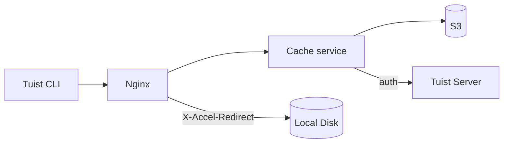
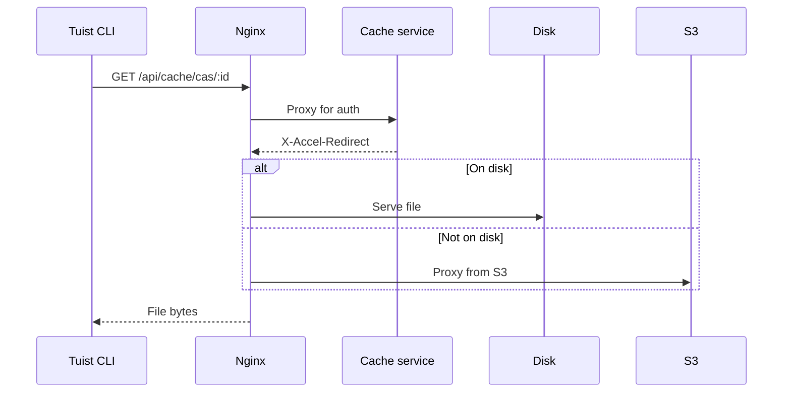
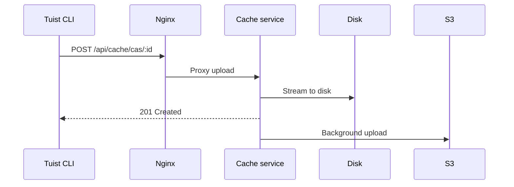

---
{
  "title": "アーキテクチャ",
  "titleTemplate": ":title | Cache | Guides | Tuist",
  "description": "Tuist キャッシュサービスのアーキテクチャについて学びます。"
}
---

# キャッシュアーキテクチャ {#cache-architecture}

> [!NOTE]
> このページでは、Tuist キャッシュサービスのアーキテクチャに関する技術的な概要を説明します。主に、サービスの内部動作を理解する必要がある **セルフホスティングユーザー** や **コントリビューター** を対象としています。キャッシュを利用したいだけの一般ユーザーは、このページを読む必要はありません。

Tuist キャッシュサービスは、ビルド成果物向けのコンテンツアドレス可能ストレージ（CAS）と、キャッシュメタデータ用のキーバリューストアを提供するスタンドアロンのサービスです。

## 概要 {#overview}

このサービスは、2層のストレージアーキテクチャとローカルの SQLite メタデータを組み合わせて使用します。

- **ローカルディスク**: 低レイテンシーなキャッシュヒットを実現するためのプライマリストレージ
- **S3**: 成果物を永続化し、エビクション後の復旧を可能にする耐久性のあるストレージ
- **SQLite**: 成果物のアクセス追跡、孤立ファイルのクリーンアップ、バックグラウンドジョブ、およびキーバリューキャッシュデータのためのローカルメタデータ

```mermaid
flowchart LR
    CLI[Tuist CLI] --> NGINX[Nginx]
    NGINX --> APP[Cache service]
    NGINX -->|X-Accel-Redirect| DISK[(Local Disk)]
    APP --> S3[(S3)]
    APP -->|auth| SERVER[Tuist Server]
```

## コンポーネント {#components}

### Nginx {#nginx}

Nginx はエントリーポイントとして機能し、`X-Accel-Redirect` を使用して効率的なファイル配信を行います。

- **ダウンロード**: キャッシュサービスが認証を検証し、`X-Accel-Redirect` ヘッダーを返します。Nginx はディスクから直接ファイルを配信するか、S3 からプロキシします。
- **アップロード**: Nginx はリクエストをキャッシュサービスにプロキシし、キャッシュサービスがデータをディスクにストリーミングします。

### コンテンツアドレス可能ストレージ {#cas}

成果物は、シャード化されたディレクトリ構造でローカルディスクに保存されます。

- **パス**: `{account}/{project}/cas/{shard1}/{shard2}/{artifact_id}`
- **シャーディング**: 成果物 ID の最初の4文字を使用して2レベルのシャードを作成します（例: `ABCD1234` → `AB/CD/ABCD1234`）

### SQLite メタデータ {#sqlite}

キャッシュサービスは2つの SQLite データベースを使用します。

- **プライマリメタデータDB**: `cache_artifacts`、孤立ファイルスキャンのカーソル、Oban ジョブ、その他のサービスメタデータを保存します。
- **キーバリューDB**: 専用の SQLite ファイルに `key_value_entries` と `key_value_entry_hashes` を保存します。

キーバリューストアは独自のデータベースに分割されており、これにより、成果物メタデータや孤立ファイルのクリーンアップ状態に影響を与えることなく、SQLite の増分自動バキュームを使用できます。

### S3 統合 {#s3}

S3 は耐久性のあるストレージを提供します。

- **バックグラウンドアップロード**: ディスクへの書き込み後、毎分実行されるバックグラウンドワーカーを通じて S3 へのアップロードがキューに入れられます。
- **オンデマンドハイドレーション**: ローカルの成果物が欠落している場合、プリサイン済み S3 URL を介して即座にリクエストに応答し、その間に成果物のローカルディスクへのバックグラウンドダウンロードをキューに入れます。

### ディスクエビクション {#eviction}

このサービスは、複数のバックグラウンドプロセスを使用してディスク容量を管理します。

- **CAS ディスクエビクション** は、`cache_artifacts` に基づく LRU セマンティクスを使用します。
- ディスク使用量が 85% を超えると、使用量が 70% に下がるまで最も古い成果物が削除されます。
- ローカルでのエビクション後も、成果物は S3 に残ります。
- **KV エビクション** は、保持期間に基づいて古いキーバリューエントリを削除し、設定されたサイズ予算を超えて拡大した場合、専用の KV データベースを縮小することもできます。

### 孤立ファイルのクリーンアップ {#orphan-cleanup}

このサービスは、ディスク上の成果物に対する孤立ファイルクリーンアップワーカーも実行します。

- ディスク上に存在するものの、対応する `cache_artifacts` レコードがないファイルをストレージツリーからスキャンします。
- これは、ファイルがディスクに書き込まれたものの、SQLite バッファのフラッシュが完了する前にメタデータの書き込みが失われた場合に発生することがあります。
- 進行中のアップロードとの競合を避けるため、安全ウィンドウより新しいファイルは無視されます。
- 孤立ファイルが削除され、後で再びリクエストされた場合、次のキャッシュミスによって再度アップロードされるため、システムは自己修復します。

### 認証 {#authentication}

キャッシュは `/api/projects` エンドポイントを呼び出し、結果をキャッシュすることで（成功時は10分、失敗時は3秒）、認証を Tuist サーバーに委譲します。

## リクエストフロー {#request-flows}

### ダウンロード {#download-flow}

```mermaid
sequenceDiagram
    participant CLI as Tuist CLI
    participant N as Nginx
    participant A as Cache service
    participant D as Disk
    participant S as S3

    CLI->>N: GET /api/cache/cas/:id
    N->>A: Proxy for auth
    A-->>N: X-Accel-Redirect
    alt On disk
        N->>D: Serve file
    else Not on disk
        N->>S: Proxy from S3
    end
    N-->>CLI: File bytes
```

### アップロード {#upload-flow}

```mermaid
sequenceDiagram
    participant CLI as Tuist CLI
    participant N as Nginx
    participant A as Cache service
    participant D as Disk
    participant S as S3

    CLI->>N: POST /api/cache/cas/:id
    N->>A: Proxy upload
    A->>D: Stream to disk
    A-->>CLI: 201 Created
    A->>S: Background upload
```

## API エンドポイント {#api-endpoints}

| エンドポイント | メソッド | 説明 |
|----------|--------|-------------|
| `/up` | GET | ヘルスチェック |
| `/metrics` | GET | Prometheus メトリクス |
| `/api/cache/cas/:id` | GET | CAS 成果物のダウンロード |
| `/api/cache/cas/:id` | POST | CAS 成果物のアップロード |
| `/api/cache/keyvalue/:cas_id` | GET | キーバリューエントリの取得 |
| `/api/cache/keyvalue` | PUT | キーバリューエントリの保存 |
| `/api/cache/module/:id` | HEAD | モジュール成果物の存在確認 |
| `/api/cache/module/:id` | GET | モジュール成果物のダウンロード |
| `/api/cache/module/start` | POST | マルチパートアップロードの開始 |
| `/api/cache/module/part` | POST | パートのアップロード |
| `/api/cache/module/complete` | POST | マルチパートアップロードの完了 |
