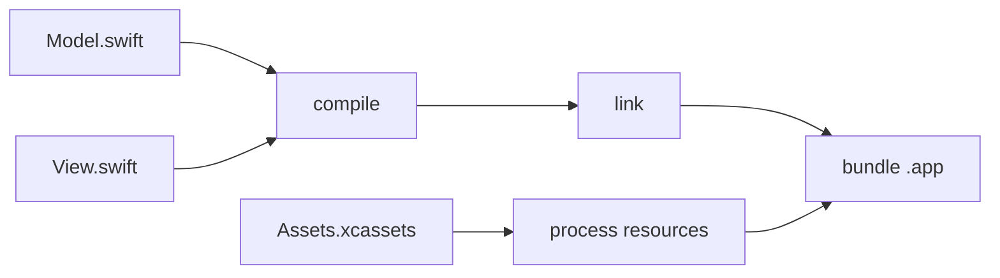

For as long as we've worked on Tuist, we've dealt with build systems from the outside. [Generated projects](https://docs.tuist.dev) sit on top of one, our caching plugs into another, and most of what we do is meet a build system where it is and make it faster or easier to live with. We rarely had a reason to open one up. From the outside it's a box you feed a project and it hands you back an app, and you can build a lot on top of that without ever asking how the box works.

Coding harnesses are what made us want to open it. They quietly broke a model most build systems were designed around, one project, one cache. Spin up a few worktrees so a couple of agents can work in parallel and, as far as the build system is concerned, you've got several unrelated projects that share nothing, each compiling the same code from scratch on the same machine. There's a name for what goes missing there, [distributed incrementality](https://pepicrft.me/blog/distributed-incrementality/), but what caught our attention was the bigger implication: if an assumption that basic had stopped holding, plenty of others probably had too. So we did the obvious thing and started tinkering with an automation layer of our own, one a coding harness could drive directly, and almost immediately hit the question of what it should even look like. You can't answer that without going back to first principles, to what a build system actually is once you take everything else away. This is the first post in a series where we work through that in the open.

## What a build system is at its core

Every one of these graphs has a language you write it in. In an Android project you describe it with Gradle. In a large monorepo you might describe it with Bazel's `BUILD` files. An Xcode project is a graph too, even if it never looks like one, hidden behind a UI and a `.pbxproj`. A Rust crate has its `Cargo.toml`. None of these is what the build system actually runs. Each one gets lowered into an intermediate representation the engine understands. Xcode, for instance, turns the project into a [PIF](https://github.com/swiftlang/swift-build), the Project Intermediate Format, before its build system ever sees it. The definition language is for humans, the intermediate format is for the machine, and the graph is the thing in the middle they both agree on.

Stripped down, a build graph is just tasks with arrows between them. Here's one for a small app, where a couple of sources compile and link into a binary while the resources are processed alongside, and everything converges on the final bundle:



Once you look past the surface syntax, these systems are doing conceptually the same thing. They take a description of tasks and dependencies, turn it into a graph, and walk that graph in the right order while doing as little work as they can get away with. Where they part ways is in how far they push that core. [Bazel](https://bazel.build) and [Buck2](https://buck2.build) pushed it furthest, and early, with remote caching so the result of a piece of work can be shared across machines, and remote execution so the work itself can be farmed out to a fleet. For years those were things only very large codebases needed, and they weren't free, because to get them you have to describe your build in Bazel's or Buck's own rules and keep those rules in sync with your code by hand. Most teams looked at that and stayed with whatever shipped with their language, [Cargo](https://doc.rust-lang.org/cargo/), [mix](https://hexdocs.pm/mix/Mix.html), [SwiftPM](https://www.swift.org/documentation/package-manager/), the [Gradle](https://gradle.org) or [Xcode](https://developer.apple.com/xcode/) setup they already had, none of which give you caching or execution across machines on their own.

Coding harnesses are changing that math. Once you have agents working across several worktrees, or generating enough change that validation has to come back fast to keep up, you find yourself wanting exactly what Bazel and Buck were built around, without a giant codebase to justify it. That leaves a question we don't have a clean answer to. Do the native build systems grow into it, so Cargo or mix eventually cache and distribute the way Bazel does? Or has the thing that kept people away from Bazel, the cost of writing and maintaining the rules, dropped far enough now that a harness can carry it, and reaching for Bazel or Buck stops being a big-company decision?

Either way, we don't want to wait for that to settle before we do anything. Our bet is narrower than picking a winner. Whenever it lands, the infrastructure underneath, the remote cache and the compute, should be cheap and fast enough that a small team or a single agent can reach for it, and not only the shops that could always afford a build team. We're also curious whether there's room for a different client on top, one shaped around how code gets written now, with agents doing a good part of the typing, instead of around one person compiling their own project. That's further out, though. The nearer problem is plainer: none of the infrastructure matters if getting to it means rewriting your build in a new language. So accessibility is where we started.

## Making it accessible

A good place to start is how you describe the graph in the first place. Bazel and Buck2 both use [Starlark](https://github.com/bazelbuild/starlark) for that, a language Google designed as a dialect of Python. It reads like Python, with functions, lists, and dictionaries, but it's deliberately smaller and stricter: no I/O, no recursion, no open-ended loops, so that evaluating a build file always terminates and always produces the same graph. On top of that it gives you real programmability, functions and macros and rules you can factor out and reuse, which is genuinely useful once you're packaging build logic to share across a large codebase. There's a good reason both of them bet on it. But it's also one more language to learn, and for a lot of people that's been more overhead than leverage. There's a newer wrinkle too: because Starlark looks so much like Python, coding harnesses tend to treat it as Python and write things that are perfectly valid Python and not valid Starlark at all. The resemblance that makes it easy to read is the same thing that trips up the model writing it.

None of that means the interface has to be Starlark. When we sat with this, the tool we kept thinking about was [mise](https://mise.jdx.dev), which we use everywhere. If you squint, mise covers a slice of what [Nix](https://nixos.org) covers, pinned tools, reproducible environments, tasks, but it asks far less of you to get there. It took a real problem and made most of it disappear behind something you can pick up in an afternoon. One answer to a hard language like Nix or Starlark is to leave the complexity where it is and let a harness deal with it for you. We lean the other way. Where complexity genuinely has to exist, and some of what Starlark does is complexity worth keeping, we'd rather compress it conceptually, in the way DHH describes with [conceptual compression](https://m.signalvnoise.com/conceptual-compression-means-beginners-dont-need-to-know-sql-hallelujah-661c1eaed983): put the hard parts behind an interface simple enough that you rarely need to open them up, without pretending they're gone.

This is also, we think, why tools like [Nx](https://nx.dev) exist at all. It's not that you can't express what Nx expresses with an engine like Bazel, you can, it's more than capable. It's that sitting down to write and maintain it there isn't something most developers find approachable, and that gap doesn't close just because a harness is doing some of the typing. An interface that's awkward for a person to reason about tends to be awkward for a model too, since in the end they're both reading and writing the same thing.

So we started tinkering with these ideas in an automation substrate we're calling [Once](https://github.com/tuist/once). We're building it as open source and as a standalone technology, deliberately decoupled from the Tuist product and our own infrastructure. The idea is for it to be a narrow waist between projects on one side and infrastructure on the other: a project describes its automation against Once, and any provider, us or someone else, can sit underneath and light it up with caching, compute, and the rest. It's in a lab phase right now, more exploration than product, and whether it becomes something we maintain and put in front of organizations depends on whether the ideas actually click once they meet real projects. This series is us working through them in the open as we go.

## Scripts as the entry point

If we weren't going to make anyone learn a new language, we had to start from something projects already have. And almost all of them have the same thing: a pile of scripts, shell scripts, mise tasks, npm scripts, a Makefile, the steps a CI file runs one after another. They compile things, generate code, process assets, package releases, run tests. The automation is already written down, we just don't tend to think of it as a build graph.

So scripts are the entry point. You keep them as they are, and you add a few annotations that say what each one reads, what it produces, and which other scripts it depends on. That's enough to turn a loose pile of scripts into a graph, and once it's a graph, opting into remote caching or remote execution isn't a rewrite and isn't a new language, it's those few lines. The script still runs the same command it always did.

Putting that metadata in comments at the top of the script is an idea we took from [usage](https://usage.jdx.dev), by the author of [mise](https://mise.jdx.dev). Usage describes a command-line tool's flags and arguments as comments in the script that implements it, so the script stays something you can run directly and the description sits right next to the thing it describes. Anything that doesn't read the comments just ignores them. We liked that enough to use the same shape for a build graph. Every node stays a plain script, the inputs and outputs and edges are comments, and Once is the tool that happens to read them.

To make this concrete, we built a small graph with a bit of a premise behind it. A lot of the appeal of [React Native](https://reactnative.dev) comes down to two things. You write the app once and reuse it everywhere, and it feels fast to work on, because a dynamic JS runtime means the build graph is small and you get something close to hot reloading. But you pay for that with the abstraction that sits between your code and the platform. So we wanted to see what happens if you drop the abstraction and lean on Rust as the shared layer instead, staying native on both sides, and put the speed back with a build system that keeps the graph fast rather than a runtime that sidesteps it.

That's the shape of the example: a shared library written in Rust, and two apps that depend on it, one on Apple platforms and one on Android. It's a setup we run into more and more, a common core in a fast, portable language with thin native apps on top, and it exercises the parts that matter, a dependency several things share, tools from different toolchains, and outputs that have to be assembled just so. Here's how it goes together, script by script.

## Wiring it up

> [!NOTE]
> We're starting small on purpose. A real build system is a much bigger thing, with dynamic dependencies, fine-grained incremental compilation, and a long tail of rule types. What follows is a simple example, the smallest version we could write that still shows the ideas from the first half working together, and a base to build the rest of the series on. Even at this size it covers a surprising share of what people actually reach for a build system to do, ordering the work, skipping what hasn't changed, and sharing results across machines.

The core is a single Rust library. It exposes one function, and it compiles two ways: a static library for Apple to link against, and a shared library for Android to load at runtime.

```rust
const GREETING: &[u8] = b"Hello from the Rust core\0";

#[no_mangle]
pub extern "C" fn core_greeting() -> *const c_char {
    GREETING.as_ptr() as *const c_char
}
```

We compile it with `rustc` directly so the script is a single genuine build step rather than a wrapper around another build system. Building it for Apple is that script, and to bring it into the graph we add a handful of comments to the top of it:

```sh
#!/usr/bin/env -S once exec -- /bin/bash
# once input "../core/src/**/*"
# once fingerprint "rustc --version"
# once env "PATH"
# once output "../core/build/apple/libcore.a"
# once cwd ".."
set -euo pipefail

mkdir -p core/build/apple
rustc --edition 2021 --crate-type staticlib \
  --target aarch64-apple-ios-sim \
  -C opt-level=z \
  core/src/lib.rs \
  -o core/build/apple/libcore.a
```

The body is exactly the command you would have run by hand. The annotations are the contract:

- `input` is what the script reads, here the Rust source.
- `output` is what it produces, the compiled `.a`.
- `fingerprint` runs `rustc --version` and folds the output into the cache key, so a compiler bump invalidates the result instead of handing back something built with the old one.
- `env` passes `PATH` through so the script runs against the toolchain we pinned.
- `cwd` says where the command runs.

The shebang routes the file through Once, so running the script is running it through the cache.

The command itself, including every flag on that `rustc` line, is already covered, because Once treats the script file as one of its own inputs. Change `-C opt-level=z` to `-C opt-level=3` and the script hashes differently, so the result is rebuilt. That's why `fingerprint` is only needed for the things the script doesn't contain, like the version of the compiler it shells out to.

Android compiles from the same `lib.rs`, but it's a different target, and `rustc` builds one target at a time, so it's a second script rather than a second flag. It produces a `.so` for the JVM to load instead of a `.a` for the linker:

```sh
#!/usr/bin/env -S once exec -- /bin/bash
# once input "../core/src/**/*"
# once fingerprint "rustc --version"
# once env "PATH"
# once env "ANDROID_NDK_HOME"
# once output "../android/app/src/main/jniLibs/arm64-v8a/libcore.so"
# once cwd ".."
set -euo pipefail

bin="$(echo "$ANDROID_NDK_HOME"/toolchains/llvm/prebuilt/*/bin)"

mkdir -p android/app/src/main/jniLibs/arm64-v8a
rustc --edition 2021 --crate-type cdylib \
  --target aarch64-linux-android \
  -C linker="$bin/aarch64-linux-android24-clang" \
  -C opt-level=z -C strip=symbols \
  core/src/lib.rs \
  -o android/app/src/main/jniLibs/arm64-v8a/libcore.so
```

The two core builds share the source and nothing else. That's what cross-compilation is: a different target, a different ABI, different machine code, so there's no build output to reuse. What they share is `core/src/lib.rs`, an input to both, so editing it rebuilds both. **One library, compiled twice.**

Run either one once and it compiles. Run it again and it doesn't:

```
$ ./scripts/build-core-apple.sh
once: cache miss action=3b9b46… exit=0
$ ./scripts/build-core-apple.sh
once: cache hit action=3b9b46… exit=0
```

Delete the library and run it a third time, and Once puts the artifact back without compiling anything, because it kept the output from the first run keyed by those inputs. Nothing about the script changed. It's the same file that was already sitting in the repo.

The apps sit on top of the core, and this is where the graph shows up. On Apple it's more than one node. Look back at the diagram at the top of this post: compiling and linking a binary is one task, packaging it into a bundle is another, and they're drawn separately. So the Apple app is two scripts. The first compiles and links the Swift against the core:

```sh
#!/usr/bin/env -S once exec -- /bin/bash
# once needs "./build-core-apple.sh"
# once input "../apple/Sources/**/*"
# once input "../core/include/core.h"
# once fingerprint "swiftc --version"
# once env "PATH"
# once output "../apple/MyApp"
# once cwd ".."
set -euo pipefail

sdk="$(xcrun --sdk iphonesimulator --show-sdk-path)"
swiftc \
  -sdk "$sdk" \
  -target arm64-apple-ios17.0-simulator \
  -import-objc-header core/include/core.h \
  -L core/build/apple \
  -lcore \
  apple/Sources/main.swift \
  -o apple/MyApp
```

It links against the core through the `-L core/build/apple -lcore` on the `swiftc` line, and the `needs` line makes the core build run first. The second script takes that binary and assembles the `.app`:

```sh
#!/usr/bin/env -S once exec -- /bin/bash
# once needs "./build-apple-binary.sh"
# once input "../apple/Info.plist"
# once input "../apple/MyApp"
# once output "../apple/MyApp.app/"
# once cwd ".."
set -euo pipefail

app="apple/MyApp.app"
rm -rf "$app"
mkdir -p "$app"
cp apple/MyApp "$app/MyApp"
cp apple/Info.plist "$app/Info.plist"
```

Now the Apple chain is three nodes, core to binary to bundle, and each `needs` line is an edge. Change the Rust and all three rebuild. Change `Info.plist` and only the bundle reassembles, because the binary it needs is untouched. **Nobody wrote a graph.** It fell out of three scripts saying what they read, what they write, and what they depend on.

> [!NOTE]
> This is a small thing for a coding agent to learn. The only new vocabulary is the handful of `# once` comments, and everything under them is the bash it already knows how to write. A harness needs that vocabulary when it writes or maintains one of these scripts, and nowhere else. Once the annotations are in place there's nothing special to run either, it's just executing shell scripts, the same ones a person would run. The surface area to pick up is a few comment lines, and from there it's back to bash.

The Android app is Kotlin and calls into Rust over JNI. The usual way to build it is Gradle, but Gradle is a build system of its own, and handing the work to it would make the whole thing one opaque node again. So we drive the underlying tools ourselves, the same way we did on Apple. It just takes more tools, because no single compiler goes from Kotlin to an installable app. `kotlinc` compiles the Kotlin and `d8` turns it into a `dex`, `aapt2` links the manifest into a resource APK, the `dex` and the Rust `.so` are packed into it, and `zipalign` and `apksigner` align and sign the result. Each of those is a script with the same handful of annotations, and each one `needs` the ones before it, so the graph is a chain: the core, the dex, and the resources feed the package, and the package feeds the signed APK.

It behaves the same way as Apple. Change the Kotlin and the dex rebuilds. Change the manifest and only resources, packaging, and signing rerun, while the dex stays cached. Change the Rust and it all reruns. Nothing here is special to a build system. `kotlinc`, `d8`, `aapt2`, `zipalign`, and `apksigner` are the steps Gradle would run for you, and once they're scripts that declare what they read and write, they're a graph. Rather than walk through all five scripts here, they're in the [example repo](https://github.com/tuist/once-example), next to the `mise.toml` that pins the toolchain and Once itself.

And it runs. The same greeting, computed once in Rust, shows up in both apps:

<div class="device-showcase">
<div class="device device-iphone"></div>
<div class="device device-android"></div>
</div>

The moment that made the point for us came while editing the Rust. We changed something cosmetic, the source hashed differently, and the core recompiled, as it should. But the compiled library came out byte for byte identical, so the Android app build, keyed on the library and not on the source that produced it, never ran. That's early cutoff, the trait from the first half of this post, and we didn't build it. It came from the store being content addressed and the scripts declaring the right inputs.

## The tools the graph depends on

There's a piece of all this the graph doesn't capture. Every script assumes its tools are simply there, `rustc`, `swiftc`, `kotlinc`, `aapt2`, and the rest. In the example we lean on a `mise.toml` next to the scripts to install them and pin their versions, and the scripts fold each compiler's version into the cache key with a `fingerprint` so a toolchain bump invalidates the result. How we happened to install the tools is an implementation detail. The part worth pausing on is that the graph depends on an environment it doesn't itself describe. It knows what a node reads and writes. It doesn't know that the node needs `rustc` to exist at all.

On your own machine this is invisible, because the tools are already installed before you run anything, whatever you happen to manage them with. It stops being invisible the moment the work leaves your machine. Run a node on someone else's computer, or on a fleet of them for remote execution, and the tools have to be there too, at the same versions, or a shared cache is worse than useless.

This is a problem [Bazel](https://bazel.build) and [Buck2](https://buck2.build) spent years on, and it's worth seeing how they landed. Both make the toolchain a first-class part of the build instead of an assumption. Bazel resolves a toolchain for each target by matching constraints against an execution platform and a target platform, so the compiler a node builds with is a declared, versioned dependency rather than whatever's on the host. Buck2 is more explicit still, with rules depending on toolchain targets directly. The aim in both is hermeticity: a build that doesn't care what happens to be installed on the machine, because everything it needs is named.

Remote execution is where it gets real. Buck2's remote execution is hermetic by design. A rule has to declare every input it touches, down to a header file, or the build fails on a worker that doesn't happen to have the undeclared one. Bazel gives you two ways to get the tools onto the workers, and the choice is most of the story. You can ship the toolchain itself as inputs, hashed like everything else, which is fully reproducible but means sending compilers over the wire. Or you point the execution platform at a container image that already has them, which is fast but turns the environment into a dependency that lives outside the graph, pinned and kept in sync by hand.

That's the tension worth naming. Push everything into the graph and it's correct but heavy, since you're shipping compilers around. Lean on a prebuilt image and it's fast, but now the environment is a thing living outside the graph that you have to keep pinned and in sync yourself. Neither escapes the need to have the right tools present, quickly, wherever a node runs. Where to draw that line, and how to stand up those environments fast enough that remotely executing parts of a graph actually pays off, is a problem of its own, and one we want to dig into in a later post.

The whole thing, the Rust core, both apps, and the scripts that build them, is at [tuist/once-example](https://github.com/tuist/once-example) if you want to read it end to end.

## Where this goes next

What the example convinced us of is that a pile of annotated shell scripts is enough to describe a real build graph, and that a coding agent can read and write that description without learning a new language. We stayed low, at the level of invoking a compiler, because that's the hardest case to make convincing. The annotations work just as well higher up. A script that installs dependencies or runs a test suite in a JavaScript workspace is a node like any other, and skipping it when nothing changed is the sort of thing you'd reach for [Nx](https://nx.dev) to do. [Once](https://github.com/tuist/once) doesn't care whether the command is `rustc` or `npm test`.

Where the work runs is a separate concern on purpose. Once talks to infrastructure through a [provider interface](https://docs.buildonce.dev/guide/infrastructure/), so the graph doesn't know who's underneath it. Tuist is one provider, the one we're building, so you can point Once at it and get low-latency remote caching without standing up anything yourself. **The graph stays yours, and the infrastructure is swappable.**

It's early, and there's more we want to poke at than we have answers for. One is observability. A build graph is a good thing for a harness to see into. It can ask what ran and what ran the last time, and find the parts worth restructuring. It can also watch for drift between what the scripts declare and what they actually do, the kind of thing that rots quietly when nobody's looking. Another is tests. Every runner has its own way of being invoked and its own way of reporting, and we'd like to know whether there's an interface that hides those differences without flattening what makes each one useful.

The one we think about most is reusability. Bazel and Buck2 built communities around sharing build logic as [rules](https://bazel.build/extending/rules), and around walking the graph to change it in bulk, Bazel with [aspects](https://bazel.build/extending/aspects), a visitor over the dependency tree, and Buck2 with [BXL](https://buck2.build/docs/bxl/), a scripting layer that inspects and extends the graph. That's real power, and it's also a dependency, because you rely on someone else maintaining the rules you build on, a little like leaning on a framework such as Expo to own the native layer for you. We're not sure that tradeoff holds the same way anymore. If a harness can read a build system and reproduce just the pieces you need, you could own your graph outright, caching and remote execution included, and fix your own problems instead of waiting for one to reach you through the next Xcode and its copy of [swift-build](https://github.com/swiftlang/swift-build). We don't know where that lands.

The layer we've barely touched is the client itself, the thing sitting between a harness and the infrastructure, and it's the one we're poking at most right now. Once you assume the client is usually an agent acting on someone's behalf, and not a person at a terminal, even the plumbing questions change shape. What's the right way for it to authenticate, when the thing holding the credential is a harness closing a loop and not the developer who kicked it off? And how should the work be attributed, when a cached result or a passing check was produced and verified by agents, so you can still trace what happened back to who, and what, actually did it? We don't have those answers, but they feel like decisions to make on purpose, not defaults to inherit from a world where the client was always a human.

> [!NOTE]
> Once is an experiment, not a finished product. It's our way of poking at what a build system designed for coding harnesses could look like, and we're sharing it this early on purpose. If any of this resonates, or if you think we have it wrong, I'd like to hear it. Email me at [pedro@tuist.dev](mailto:pedro@tuist.dev) and let's trade notes.
