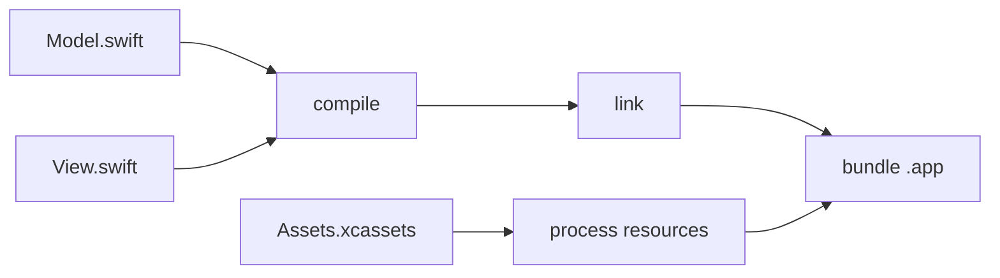

For as long as I've worked on Tuist, I've looked at build systems from the outside. We [generate projects](https://docs.tuist.dev) that sit on top of one, our caching plugs into another, and most of the job is to meet a build system where it is and make it faster or less painful to live with. We rarely had a reason to open one up. From the outside it's a box: you feed it a project, it hands you back an app, and you can build a lot on top of that without ever asking how the box works.

Coding harnesses are what made me want to open it. They broke a model almost every build system was designed around, one project, one cache. Spin up a few worktrees so a couple of agents can work in parallel and, as far as the build system is concerned, you have several unrelated projects that share nothing, each compiling the same code from scratch on the same machine. I gave that missing thing a name in [another post](https://pepicrft.me/blog/distributed-incrementality/), distributed incrementality, but the part that stuck with me was bigger. If an assumption that basic had quietly stopped holding, how many others had too? So we did the obvious thing and started tinkering with an automation layer of our own, one a harness could drive directly. And almost immediately we hit a wall: what should it even look like? You can't answer that without going back to first principles, to what a build system actually is once you strip everything else away. This is the first post in a series where I work through that in the open.

## What a build system is at its core

Every build system starts from the same place: a graph of tasks that describes what has to happen for something to get built or tested. What differs is the language you write on top of it. In an Android project that's Gradle. In a big monorepo it's Bazel's `BUILD` files. An Xcode project is a graph too, even if it never looks like one, buried under a UI and a `.pbxproj`. A Rust crate has its `Cargo.toml`. None of those is what the build system actually runs. Each gets lowered into an intermediate form the engine understands. Xcode, for one, turns the project into a [PIF](https://github.com/swiftlang/swift-build), its Project Intermediate Format, before the build system ever sees it. The language is for humans, the intermediate form is for the machine, and the graph is the thing in the middle they both agree on.

Stripped down, that graph is just tasks with arrows between them. Here's one for a small app, where a couple of sources compile and link into a binary while the resources get processed alongside, and everything converges on the bundle:



Once you look past the surface syntax, every one of these systems is doing the same thing. It takes a description of tasks and dependencies, turns it into a graph, and walks that graph in order while doing as little work as it can get away with. Where they split is how far they push that core. [Bazel](https://bazel.build) and [Buck2](https://buck2.build) pushed it the furthest, and early: remote caching, so the result of a piece of work can be shared across machines, and remote execution, so the work itself can be handed to a fleet. For years that was a big-company thing, and it wasn't free, because to get it you had to describe your build in Bazel's or Buck's own rules and keep those rules in sync with your code by hand. Most teams took one look and stayed with whatever shipped with their language, [Cargo](https://doc.rust-lang.org/cargo/), [mix](https://hexdocs.pm/mix/Mix.html), [SwiftPM](https://www.swift.org/documentation/package-manager/), the [Gradle](https://gradle.org) or [Xcode](https://developer.apple.com/xcode/) setup they already had, none of which give you caching or execution across machines on their own.

Coding harnesses are changing that math. Put a few agents to work across several worktrees, or have them generate enough change that validation has to keep up, and you find yourself wanting exactly what Bazel and Buck were built for, without a codebase big enough to justify them. Which leaves a question I don't have a clean answer to. Do the native build systems grow into it, so Cargo or mix eventually cache and distribute the way Bazel does? Or has the cost of the rules dropped far enough, now that a harness can carry it, that reaching for Bazel or Buck stops being a big-company decision?

Either way, I'm not going to wait for that to settle before doing anything. Our bet is narrower than picking a winner. Whenever it lands, the infrastructure underneath, the remote cache and the compute, should be cheap and fast enough that a small team or a single agent can reach for it, not just the shops that could always afford a build team. What I'm more curious about is what sits on top: whether there's room for a different client, a build system shaped around how code gets written now, with agents doing a lot of the typing, instead of around one person compiling their own project. That's further out, though. The nearer problem is plainer. None of the infrastructure matters if getting to it means rewriting your build in a new language. So accessibility is where we started.

## Making it accessible

Start with how you describe the graph. Bazel and Buck2 both use [Starlark](https://github.com/bazelbuild/starlark), a language Google built as a dialect of Python. It reads like Python, functions and lists and dictionaries, but it's smaller and stricter on purpose: no I/O, no recursion, no open-ended loops, so evaluating a build file always terminates and always gives the same graph. On top of that you get real programmability, macros and rules you can factor out and share, which genuinely helps once you're packaging build logic across a huge codebase. There's a good reason both of them bet on it. But it's still one more language to learn, and for a lot of people that's been more overhead than leverage. And there's a newer catch. Because Starlark looks so much like Python, coding harnesses treat it as Python, write something that's perfectly valid Python and not valid Starlark, and burn cycles finding out. The resemblance that makes it easy to read is the thing that trips up the model writing it.

None of that means the interface has to be Starlark. The tool I kept thinking about while chewing on this was [mise](https://mise.jdx.dev), which we use everywhere. Squint and mise covers a slice of what [Nix](https://nixos.org) covers, pinned tools, reproducible environments, tasks, but it asks far less of you to get there. It took a real problem and made most of it disappear behind something you can pick up in an afternoon. One way to deal with a hard language like Nix or Starlark is to leave the complexity where it is and let a harness wrestle with it for you. I lean the other way. Where complexity genuinely has to exist, and some of what Starlark does is worth keeping, I'd rather compress it conceptually, the way DHH describes with [conceptual compression](https://m.signalvnoise.com/conceptual-compression-means-beginners-dont-need-to-know-sql-hallelujah-661c1eaed983): put the hard parts behind an interface simple enough that you rarely need to open it, without pretending they're gone.

It's also, I think, why something like [Nx](https://nx.dev) exists at all. It's not that you can't express what Nx expresses with an engine like Bazel. You can, it's more than capable. It's that sitting down to write and maintain it there isn't something most developers find approachable, and that gap doesn't close just because a harness is doing some of the typing. An interface that's awkward for a person to reason about tends to be awkward for a model too, because in the end they're reading and writing the same thing.

So we started tinkering with these ideas in an automation substrate we're calling [Once](https://github.com/tuist/once). We're building it as open source and as a standalone thing, decoupled on purpose from the Tuist product and our own infrastructure. The idea is a narrow waist between projects on one side and infrastructure on the other: a project describes its automation against Once, and any provider, us or someone else, can sit underneath and light it up with caching and compute. It's early, more exploration than product, and whether it turns into something we maintain and put in front of teams depends on whether the ideas actually click once they meet real projects. This series is me working through them in the open.

## Scripts as the entry point

If we weren't going to make anyone learn a new language, we had to start from something projects already have. And almost every project has the same thing: a pile of scripts. Shell scripts, mise tasks, npm scripts, a Makefile, the steps a CI file runs one after another. They compile things, generate code, process assets, package releases, run tests. The automation is already written down. We just don't tend to think of it as a build graph.

So that's the entry point. You keep the scripts as they are and add a few comments that say what each one reads, what it writes, and which other scripts it depends on. That's enough to make it a graph, and once it's a graph, opting into remote caching or remote execution isn't a rewrite and isn't a new language. It's those few lines. The script still runs the same command it always did.

A shell script is about as native as it gets for a coding harness. These models have read and written millions of them, and a harness already knows how to run one and read back what happened. When it's time to execute, it doesn't need to know the file is routed through a cache, or that its inputs and outputs put it in a graph. It sees a script, runs it, gets a result. The machinery underneath stays out of the way unless something is writing or changing the script, and the rest of the time it's just bash. That's the whole reason to lean on an interface people and models already speak.

Putting the metadata in comments at the top of the script is an idea we took from [usage](https://usage.jdx.dev), by the author of [mise](https://mise.jdx.dev). Usage describes a command-line tool's flags and arguments as comments in the script that implements it, so the script stays runnable and the description sits right next to the thing it describes. Anything that doesn't read the comments ignores them. We liked that enough to steal the shape for a build graph. Every node is a plain script, the inputs and outputs and edges are comments, and Once is the tool that happens to read them.

To make this concrete, I built a small graph with a premise behind it. A lot of the appeal of [React Native](https://reactnative.dev) comes down to two things. You write the app once and run it everywhere, and it feels fast to work on, because a dynamic JS runtime keeps the build graph small and gets you close to hot reloading. You pay for it with the abstraction sitting between your code and the platform. So I wanted to see what happens if you drop the abstraction and lean on Rust as the shared layer instead, native on both sides, and put the speed back with a build system that keeps the graph fast rather than a runtime that skips it.

That's the shape of the example: a shared library in Rust, and two apps that depend on it, one on Apple platforms and one on Android. It's a setup I run into more and more, a common core in a fast, portable language with thin native apps on top, and it exercises the parts that matter: a dependency several things share, tools from different toolchains, and outputs that have to be assembled just so. Here's how it goes together, script by script.

## Wiring it up

> [!NOTE]
> This is deliberately a toy. A real build system is a much bigger animal, with dynamic dependencies, fine-grained incremental compilation, and a long tail of rule types. What follows is the smallest example I could write that still shows the ideas from the first half working together, and a base for the rest of the series. Even at this size it covers a surprising share of what people actually reach for a build system to do: ordering the work, skipping what hasn't changed, and sharing results across machines.

The core is a single Rust library. One function, compiled two ways: a static library for Apple to link against, and a shared library for Android to load at runtime.

```rust
const GREETING: &[u8] = b"Hello from the Rust core\0";

#[no_mangle]
pub extern "C" fn core_greeting() -> *const c_char {
    GREETING.as_ptr() as *const c_char
}
```

We compile it with `rustc` directly, so the script is a real build step and not a wrapper around another build system. Building it for Apple is that script, and to put it in the graph we add a handful of comments at the top:

```sh
#!/usr/bin/env -S once exec -- /bin/bash
# once input "../core/src/**/*"
# once fingerprint "rustc --version"
# once env "PATH"
# once output "../core/build/apple/libcore.a"
# once cwd ".."
set -euo pipefail

mkdir -p core/build/apple
rustc --edition 2021 --crate-type staticlib \
  --target aarch64-apple-ios-sim \
  -C opt-level=z \
  core/src/lib.rs \
  -o core/build/apple/libcore.a
```

The body is exactly what you'd have run by hand. The comments are the contract:

- `input` is what it reads, here the Rust source.
- `output` is what it writes, the compiled `.a`.
- `fingerprint` runs `rustc --version` and folds the result into the cache key, so a compiler bump invalidates the build instead of handing back something made with the old one.
- `env` passes `PATH` through so the script runs against the toolchain we pinned.
- `cwd` says where it runs.

The shebang routes the file through Once, so running the script is running it through the cache.

The command itself, every flag on that `rustc` line, is already covered, because Once treats the script file as one of its own inputs. Change `-C opt-level=z` to `-C opt-level=3` and the script hashes differently, so it rebuilds. That's why `fingerprint` is only for the things the script doesn't contain, like the version of the compiler it shells out to.

Android compiles from the same `lib.rs`, but it's a different target, and `rustc` does one target at a time, so it's a second script rather than a second flag. It produces a `.so` for the JVM to load instead of a `.a` for the linker:

```sh
#!/usr/bin/env -S once exec -- /bin/bash
# once input "../core/src/**/*"
# once fingerprint "rustc --version"
# once env "PATH"
# once env "ANDROID_NDK_HOME"
# once output "../android/app/src/main/jniLibs/arm64-v8a/libcore.so"
# once cwd ".."
set -euo pipefail

bin="$(echo "$ANDROID_NDK_HOME"/toolchains/llvm/prebuilt/*/bin)"

mkdir -p android/app/src/main/jniLibs/arm64-v8a
rustc --edition 2021 --crate-type cdylib \
  --target aarch64-linux-android \
  -C linker="$bin/aarch64-linux-android24-clang" \
  -C opt-level=z -C strip=symbols \
  core/src/lib.rs \
  -o android/app/src/main/jniLibs/arm64-v8a/libcore.so
```

The two core builds share the source and nothing else. That's what cross-compilation is: different target, different ABI, different machine code, nothing to reuse between them. What they share is `core/src/lib.rs`, an input to both, so editing it rebuilds both. **One library, compiled twice.**

Run either one once and it compiles. Run it again and it doesn't:

```
$ ./scripts/build-core-apple.sh
once: cache miss action=3b9b46… exit=0
$ ./scripts/build-core-apple.sh
once: cache hit action=3b9b46… exit=0
```

Delete the library and run it a third time, and Once puts it back without compiling anything, because it kept the output from the first run keyed by those inputs. Nothing about the script changed. It's the same file that was already in the repo.

The apps sit on top of the core, and this is where the graph shows up. On Apple it's more than one node. Look back at the diagram: compiling and linking the binary is one task, packaging it into a bundle is another, and they're drawn apart. So the Apple app is two scripts. The first compiles and links the Swift against the core:

```sh
#!/usr/bin/env -S once exec -- /bin/bash
# once needs "./build-core-apple.sh"
# once input "../apple/Sources/**/*"
# once input "../core/include/core.h"
# once fingerprint "swiftc --version"
# once env "PATH"
# once output "../apple/MyApp"
# once cwd ".."
set -euo pipefail

sdk="$(xcrun --sdk iphonesimulator --show-sdk-path)"
swiftc \
  -sdk "$sdk" \
  -target arm64-apple-ios17.0-simulator \
  -import-objc-header core/include/core.h \
  -L core/build/apple \
  -lcore \
  apple/Sources/main.swift \
  -o apple/MyApp
```

It links against the core through the `-L core/build/apple -lcore` on the `swiftc` line, and the `needs` line makes the core build run first. The second takes that binary and assembles the `.app`:

```sh
#!/usr/bin/env -S once exec -- /bin/bash
# once needs "./build-apple-binary.sh"
# once input "../apple/Info.plist"
# once input "../apple/MyApp"
# once output "../apple/MyApp.app/"
# once cwd ".."
set -euo pipefail

app="apple/MyApp.app"
rm -rf "$app"
mkdir -p "$app"
cp apple/MyApp "$app/MyApp"
cp apple/Info.plist "$app/Info.plist"
```

So the Apple chain is three nodes, core to binary to bundle, and each `needs` line is an edge. Change the Rust and all three rebuild. Change `Info.plist` and only the bundle reassembles, because the binary it needs is untouched. **Nobody wrote a graph.** It fell out of three scripts saying what they read, what they write, and what they depend on.

The Android app is Kotlin and calls into Rust over JNI. The usual way to build it is Gradle, but Gradle is its own build system, and handing the work to it would collapse the whole thing back into one opaque node. So we drive the tools ourselves, like on Apple. It just takes more of them, because no single compiler goes from Kotlin to an installable app. `kotlinc` compiles the Kotlin and `d8` turns it into a `dex`, `aapt2` links the manifest into a resource APK, the `dex` and the Rust `.so` get packed in, and `zipalign` and `apksigner` align and sign the result. Each one is a script with the same handful of comments, and each `needs` the ones before it, so the graph is a chain: the core, the dex, and the resources feed the package, and the package feeds the signed APK.

It behaves the same as Apple. Change the Kotlin and the dex rebuilds. Change the manifest and only the resource, packaging, and signing steps rerun, while the dex stays cached. Change the Rust and it all reruns. Nothing here is special to a build system. `kotlinc`, `d8`, `aapt2`, `zipalign`, and `apksigner` are the steps Gradle would run for you, and once they're scripts that declare what they read and write, they're a graph. Instead of walking all five here, they're in the [example repo](https://github.com/tuist/once-example), next to the `mise.toml` that pins the toolchain and Once itself.

And it runs. The same greeting, computed once in Rust, shows up in both apps:

<div class="device-showcase">
<div class="device device-iphone"></div>
<div class="device device-android"></div>
</div>

The moment it clicked for us was while editing the Rust. We changed something cosmetic, the source hashed differently, and the core recompiled, as it should. But the compiled library came out byte for byte identical, so the Android app build, keyed on the library and not on the source behind it, never ran. That's early cutoff, the trait from the first half, and we didn't build it. It fell out of the store being content addressed and the scripts declaring the right inputs.

## What this means for a harness

Come back to the thing that set this off: the coding harness. We went into build systems because a harness needs a way to close its own loop, and the test for any interface we landed on was whether an agent could live in it without much ceremony. Looking at the finished thing, a Rust core and two native apps built out of plain scripts, I think it holds. The only vocabulary that isn't already bash is the `# once` comments, and an agent reaches for them only when it writes or changes a script.

That's most of what I wanted. Writing these scripts is squarely what the models are good at. Keeping the comments honest is a local edit, because they live next to the command they describe instead of in a separate build model that drifts out of sync. And running the graph is just running scripts, so the caching and the remote execution never come up as something the agent has to reason about. The layer we wanted a harness to drive ended up looking a lot like the scripts already in the repo, with a few comments on top.

## The tools the graph depends on

There's one piece of this the graph doesn't capture. Every script assumes its tools are just there, `rustc`, `swiftc`, `kotlinc`, `aapt2`, all of it. In the example we lean on a `mise.toml` next to the scripts to install them and pin their versions, and the scripts fold each compiler's version into the key with a `fingerprint` so a toolchain bump invalidates the build. How we install the tools is an implementation detail. The part worth sitting with is that the graph depends on an environment it doesn't describe. It knows what a node reads and writes. It doesn't know the node needs `rustc` to exist at all.

On your own machine that's invisible, because the tools are already there before you run anything, whatever you manage them with. It stops being invisible the second the work leaves your machine. Run a node on someone else's computer, or on a fleet of them for remote execution, and the tools have to be there too, at the same versions, or a shared cache is worse than useless.

This is a problem [Bazel](https://bazel.build) and [Buck2](https://buck2.build) spent years on, and it's worth seeing where they landed. Both make the toolchain a first-class part of the build instead of an assumption. Bazel resolves a toolchain per target by matching constraints against an execution platform and a target platform, so the compiler a node builds with is a declared, versioned dependency and not whatever happens to be on the host. Buck2 goes further, with rules depending on toolchain targets directly. The aim in both is hermeticity: a build that doesn't care what's installed on the machine, because everything it needs is named.

Remote execution is where this gets real. Buck2's remote execution is hermetic by design. A rule has to declare every input it touches, down to a header file, or the build fails on a worker that doesn't have the undeclared one. Bazel gives you two ways to get the tools onto the workers, and the choice is most of the story. You ship the toolchain itself as inputs, hashed like everything else, which is fully reproducible but means sending compilers over the wire. Or you point the execution platform at a container image that already has them, which is fast but turns the environment into a dependency that lives outside the graph, pinned and kept in sync by hand.

That's the tension. Push everything into the graph and it's correct but heavy, you're shipping compilers around. Lean on a prebuilt image and it's fast, but now there's an environment sitting outside the graph that you have to keep honest yourself. Neither one escapes the need to have the right tools present, fast, wherever a node runs. Where to draw that line, and how to stand up those environments quickly enough that running parts of a graph remotely actually pays off, is its own problem, and one I want to dig into in a later post.

The whole thing, the Rust core, both apps, and the scripts that build them, is at [tuist/once-example](https://github.com/tuist/once-example) if you want to read it end to end.

## Where this goes next

None of this is specific to compilers. We stayed at the level of invoking `rustc` because it's the hardest case to make convincing, but a script that installs dependencies or runs a test suite in a JavaScript workspace is a node like any other, and skipping it when nothing changed is exactly the kind of thing you'd reach for [Nx](https://nx.dev) to do. Once doesn't care whether the command is `rustc` or `npm test`.

Where the work runs is a separate concern, on purpose. Once talks to infrastructure through a [provider interface](https://docs.buildonce.dev/guide/infrastructure/), so the graph doesn't know or care who's underneath it. Tuist is one provider, the one we're building, so you can point Once at it and get low-latency remote caching without standing anything up yourself. The graph stays yours, the infrastructure is swappable.

It's early, and there's more I want to poke at than I have answers for. One is observability. A build graph is a great thing for a harness to see into: what ran, what ran last time, which parts are worth restructuring. There's a related question of drift, whether what the scripts declare still matches what they actually do, which rots quietly when no one is looking, and which a tool could keep honest. Another is tests. Every runner has its own way of being invoked and its own way of reporting, and I'd like to know if there's an interface that hides those differences without flattening what makes each one useful.

The one I keep circling is reusability. Bazel and Buck2 built whole communities around sharing build logic as [rules](https://bazel.build/extending/rules), and around walking the graph to change it in bulk, Bazel with [aspects](https://bazel.build/extending/aspects), a visitor over the dependency tree, Buck2 with [BXL](https://buck2.build/docs/bxl/), a scripting layer that inspects and extends the graph. That's real power. It's also a dependency: you rely on someone else maintaining the rules you build on, a bit like leaning on a framework like Expo to own the native layer for you. I'm not sure that trade holds the same way anymore. If a harness can read a build system and reproduce just the pieces you need, you could own your graph outright, caching and remote execution included, and fix your own problems instead of waiting for one to reach you through the next version of Xcode and its copy of [swift-build](https://github.com/swiftlang/swift-build). I don't know where that lands.

There's also the layer we've barely touched, the client between a harness and the infrastructure, and it's the one we're poking at most right now. Once you assume the client is usually an agent acting on someone's behalf, and not a person at a terminal, even the plumbing questions change shape. What's the right way for it to authenticate, when the thing holding the credential is a harness closing a loop and not the developer who kicked it off? And how do you attribute the work, when a cached result or a passing check was produced and verified by agents, so you can still trace it back to who, and what, actually did it? I don't have those answers, but they feel like decisions to make on purpose, not defaults to inherit from a world where the client was always a human.

> [!NOTE]
> Once is an experiment for now, not a finished product, though it may grow into one if the ideas hold up as they meet real projects. It's my way of poking at what a build system designed for coding harnesses could look like, and I'm sharing it this early on purpose. If any of this resonates, or if you think I have it wrong, I'd like to hear it. Email me at [pedro@tuist.dev](mailto:pedro@tuist.dev) and let's trade notes.
