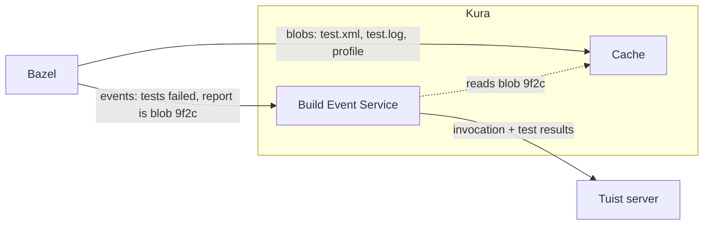

If there's one build system that's ahead of the rest in helping teams with the challenges of code being written fast and concurrently, it's Bazel. Did you know that Bazel motivated our initial work on Tuist? Over the years, we drew a lot of inspiration from it, for example, when building our module cache on top of Xcode project generation. And as we kept investing in infrastructure and in supporting other build systems, it became clear that we had to support Bazel. Well, that time is here.

I went back and forth a few times on how to approach this blog post. An agent could look at Bazel's documentation and our implementation, give it some structure, and call it done. But that felt wrong. Not just because of the writing style, but because it's tiring to read blog posts that are a sequence of facts, one after another. So I took a step back and asked myself: what would I want to read if I had been following Tuist and, all of a sudden, saw these folks talking about Bazel? That's what I want this post to be, and I hope you like it (and that Codex doesn't leave any typos anywhere).

## Kura

In a previous blog post, I talked about the importance of low latency for small cache artifacts. Bazel's cache artifacts can be very granular, which means that before building an integration with Bazel, we had to shorten the latency between compute and cache. And let me tell you, that's quite a challenge. Many services colocate compute and cache and call it done. We offer that too, but it only solves the problem for remote automation like CI. What about developers working from other regions? Then we're talking about a distributed system, where the cache needs to be replicated across all those nodes. We built a technology, Kura, and a Kubernetes-based deployment system to solve that, but it's so cool that it deserves its own blog post. For now, I'll just say that we have a regional network of cache servers where we can dedicate resources, and we've designed the economics so that anyone can access the cache and have a good experience with it.

And that's very important to us. Caching is something everyone wants (who says no to shorter build times?). Like everyone else, we'd love to sell the bundle, since its economics are much more attractive than selling cache to an indie developer. But we think that's short-sighted, because that developer might join a company in the future or build something unprecedented, and we want to be part of that journey. Our cache must be fast and reasonably priced for anyone, from anywhere.

Dogfooding is crucial for improving the product, so guess which build system we use to build Kura, which is written in Rust, with its own cache: Bazel. So if you see me mentioning Kura around, now you know what it is.

## Authentication and attribution

With the technology and infrastructure out of the way, we started working on authenticating Bazel against our servers. We read docs, checked other products, and also sent our agents to look around and summarize the state of things. We didn't like what we saw. Some solutions ask teams to create a token in a dashboard and share it across all environments, which is bad security-wise. Others use a token per member, which is slightly better but inconvenient: developers have to go to a dashboard, generate a value, copy it, and place it in the right spot in their environment. That's not the developer experience we strive for at Tuist.

The Tuist CLI, which we conveniently distribute through [Mise](https://mise.jdx.dev), has authentication and session management built in. `tuist auth login` completes the authentication in the browser and then continues in the terminal. From that moment on, the CLI manages a short-lived access token and a longer-lived refresh token in the background, rotating the access token and dealing with concurrent refreshes across processes. It's something we've iterated on over the years and know works smoothly, so we wanted to tap into it. The question was how.

We looked at what Bazel provides and quickly discarded the most static options:

- **Google credentials:** Not really an option. Users authenticate against Tuist, not Google.
- **`.netrc`, static headers, a username and password in the URL, client certificates:** This is exactly the kind of static setup we wanted to avoid. It's inconvenient for developers, and teams work around the inconvenience by sharing credentials with everyone, which is wrong.

That left us with credential helpers, the most dynamic option on the list. What if a helper could wire Bazel into our credential management logic? We quickly realized we had to get creative. Bazel invokes the helper with a single argument, `get`, from the workspace root, and nothing else. That's not enough context for us: the Tuist project might live in a subdirectory of the workspace, and the helper also needs to know where the generated Bazel configuration lives. So we couldn't point Bazel straight at the `tuist` executable. But what if a small script acted as a stateful proxy between Bazel and Tuist? That's how we landed on one helper per repository worktree, at `<config dir>/credentials/tuist-bazel-credential-helper-<account>-<project>-<hash>`. The script remembers which checkout it belongs to and passes that to the helper logic in the Tuist CLI, which reads the project's configuration to know the account and project. All Bazel expects back is a payload with the headers to attach and when they expire:

```json
{
  "headers": {
    "Authorization": ["Bearer <token>"]
  },
  "expires": "2026-09-10T12:09:00Z"
}
```

Attribution, on the other hand, was the easy part: the generated configuration tells Bazel to send the account and project with every request, so we know who each cache hit belongs to. With all of this in place, plugging Bazel into Tuist's remote cache takes just two commands:

```bash
tuist auth login  # Once, across all your repositories
tuist bazel setup # Once per repository
```

As people obsessed with developer experience, we'd love to have it all in a single step: run `bazel build`, get prompted to log in if you aren't authenticated, and skip the helper indirection altogether. Unfortunately, that's not something we control. Hopefully, one day, we'll have a tiny bit of influence on Bazel's direction, but that wasn't the focus of this effort. If you steer Bazel and you're open to it, we'd be happy to contribute.

## Cache

Alright, Bazel can now authenticate its requests. Next, we needed the cache server to speak Bazel's cache protocol. Which one is that? Glad you asked, 'cause we asked ourselves the same question. It's called the Remote Execution API (REAPI), and it turns out it's simpler than you'd imagine. It builds on two pieces: a content-addressable store, where every file lives under the hash of its contents, and action cache items. An action cache item remembers the result of a build step. Its key is a hash of the step's command, environment, and declared inputs, and its value points at the outputs that step produced. When a machine using the same cache reaches that step again, Bazel reuses those outputs instead of running it.

```json
{
  "actionDigest": { "hash": "e3d9…7a02", "sizeBytes": "148" },
  "actionResult": {
    "outputFiles": [
      { "path": "bin/Networking.swiftmodule", "digest": { "hash": "5c0e…91d4", "sizeBytes": "182344" } },
      { "path": "bin/Client.o", "digest": { "hash": "9f2c…b41a", "sizeBytes": "48213" } }
    ],
    "exitCode": 0
  }
}
```

Are you still with me? I hope so, 'cause these days it's tricky to hold anyone's attention. I hope the snippet above caught yours, because it captures Bazel's cache really well. The payload represents the result of compiling a `Networking` module. Note how it references the compilation that happened, its exit code, and the files it produced. Which is a beautiful segue into the protocol's other building block: CAS blobs. Notice that those output files have hashes. They point to blobs, the binaries behind those files, which Bazel can retrieve instead of running the same action locally. It fetches only the ones it actually needs and skips the work altogether.

<!-- Illustration: how Bazel interacts with the action cache and the CAS. -->

While writing this, I wondered why Google chose gRPC as the transport here. Unfortunately, not much has been written about it, and we weren't at Google to witness the decision from the inside. But it seems the API was designed with remote execution in mind first, and caching came along with it. Remote execution needs streaming progress, streaming of large files, cancellation, and flow control, which are exactly the features gRPC's 2015 design principles list, along with metadata for auth and standard status codes.

So on the server side, we implemented that protocol. The challenge wasn't implementing the contract, but writing and reading those files as efficiently as possible while treating resources as bounded. That's a topic for the Kura blog post, though. With authentication in place, the caching protocol implemented, and accounts getting their own deployed cache instances, we had our Bazel remote cache, which we'd use to build Kura itself. Isn't that cool? However, something was missing... We don't consider support for a build system complete until it comes with insights, so that users understand their builds, their test runs, and how they interact with the cache. We don't consider it ready either until we match our competitors' floor in breadth, and then top it up with our sprinkles of developer experience and UI. First we make it work, then we make it the best. Everyone has similar menus; we want a Michelin-star one. Not sure if I should be saying this, but we're here to compete, right? I don't think that's a secret to anyone, and we'll all get better for it. So, let's talk about insights.

## Insights

Next up: getting those insights into the server. Guess what, there's another language. Bazel speaks more languages than Spain does (yes, a human wrote this). Jokes aside, there was another protocol to learn, and a few quirks we only discovered along the way. It's called the Build Event Protocol (BEP), and it's sent over the Build Event Service (BES). Where the cache protocol is about storing what a build produces, this one is about what happens during it. I won't go into the details, but in a nutshell, Bazel narrates every command as a stream of protobuf events: the start, progress output, configured targets, test results, metrics, and the finish with an exit code.

How naive we were. We thought implementing the protocol, persisting the events, and showing them in a dashboard would be it. If you know Bazel, you're probably laughing right now. We quickly ran into a design trait that made our plan incomplete: the events carry facts and references to files, and the files themselves travel through the cache.

What does that mean in practice? Say you run your tests with Bazel. I expected the results to come through the event stream with everything else, and I couldn't have been more wrong. The events tell you that a test target failed, but the details, like the JUnit report (`test.xml`), the test logs, or the build's timing profile, are uploaded to the cache as blobs, and the events only point at them by hash. Whoever receives the events has to go and get those files from the cache. Otherwise, all you can show is that tests ran and whether they passed, not which ones failed or why.



My first reaction was that I'd have designed it differently, because integrating with it felt unnecessarily complicated. But things like this are usually done for a reason, so, like any modern software developer, I asked Codex to dig into why. And there's a good one. With remote execution or remote caching, the machine sending the events often doesn't have those files. The test might have run on a remote worker or come straight from the cache, and Bazel avoids downloading outputs it doesn't need. All it has is the hash, so a reference is the only thing it can send without downloading the file just to upload it again. On top of that, test reports can be arbitrarily large, and stuffing them into an ordered stream would hold up every event behind them. And the cache already knows how to store and deduplicate files, so there's no reason for a second way of moving them.

Once that clicked, the design worked in our favor. Kura is both the cache and the event receiver, so when an event points at a test report, the file is already sitting in its storage. Kura reads it locally, sends a bounded copy to the server along with the invocation, and your build never waits for any of it.
